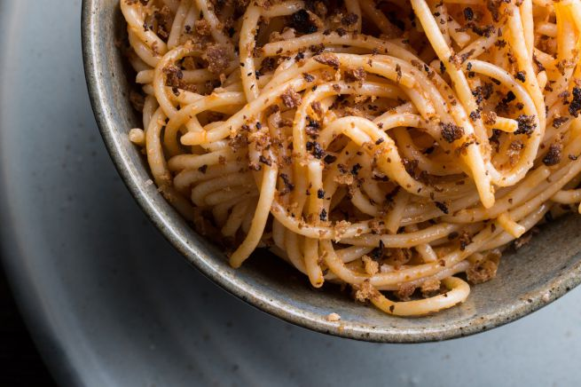

La ricetta della pasta con tonno e pangrattato è un primo piatto salvacena, è velocissimo e buono, si prepara in pochi minuti e si può personalizzare aggiungendo olive, capperi, aglio o peperoncino. Vediamo insieme come si prepara questa pasta al tonno un po’ speciale.

Ingredients
===========

* 350gr di pasta lunga
* 1 scatoletta di tonno sott’olio grande
* Pangrattato
* Sale
* Pepe
* Prezzemolo fresco
* Olio extravergine di oliva                         

Preparation
===========

Mettete sul fuoco l’acqua per la pasta, poi versate gli spaghetti e cuoceteli seguendo il tempo indicato nella confezione.

Nel frattempo in una padella tostate il pangrattato a fuoco dolce, aggiungete il sale, il tonno sgocciolato e il prezzemolo tritato, mescolate bene e fate attenzione a non far bruciare tutto.

Scolate la pasta e conditela con questo composto di tonno, aggiungete qualche cucchiaio di olio, mescolate bene e servite con una macinata di pepe fresco.

Notes
=====
