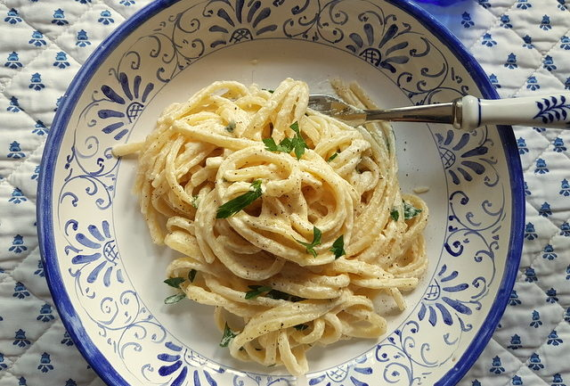

A beautiful easy to make spring/summer recipe from the land of lemons in Southern Italy

Ingredients
===========

* 400gr linguine or tagliolini or spaghetti
* 2 organic unwaxed lemons preferably from Amalfi or Sorrento
* 150-200ml heavy cream
* 50g Parmesan cheese grated
* 1 handful fresh parsley chopped
* 50gr butter
* salt for pasta and to taste
* black pepper to taste
* 1tbsp extra virgin olive oil

Preparation
===========

Grate off the zest/peel of the lemons being careful to leave the pith (white part). Then cut the lemon(s) in two. You want to end up with about a flat tablespoonful of zest

Put a pot of water on to boil for the pasta. Add a half lemon (or two) to the water, squeezing the lemon juice into the water. When the water comes to a boil, add salt, let it come to the boil again and add the pasta.

Meanwhile, heat the olive oil and butter in a frying pan or skillet. Add the lemon zest and let it cook just a few moments, until you begin to smell the lemon. Then add the cream to the pan, Stir well and add the grated Parmesan cheese, a pinch of salt and ground pepper. 

Allow the cream to cook a bit, then turn it off. Add a generous sprinkling of finely chopped parsley and mix.

Cook the pasta until just al dente according to the instructions on the packet. When the pasta is almost cooked, add a half ladle of the pasta cooking water to the lemon cream and stir it in. Save a bit more of the pasta cooking water and then drain the pasta and transfer it to the pan with the sauce 

Mix well, allowing the pasta to absorb the flavors of the sauce and adding a little more pasta cooking water if the sauce is too thick. 

Serve immediately, sprinkled with alittle more grated lemon zest, chopped parsley and grated Parmesan if required. 

Notes
=====
