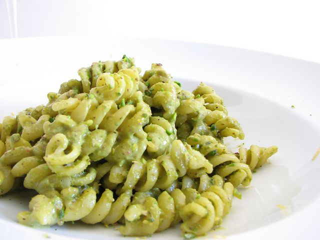

Da quando l'ho scoperta a casa di amici qualche anno fa, è entrata di diritto tra i miei primi piatti preferiti, tanto da proporla molto spesso nell'ambito dei pranzi a casa mia. E' incredibile quanto la pasta al pistacchio, panna e pancetta sia gustosa, una vera coccola per il palato. Caratterizzata da un condimento cremoso, un accentuato sapore di pancetta che viene mitigato dalla panna e la nota preziosa donata dai pistacchi, la pietanza che ne viene fuori si presta anche ad essere proposta in occasioni speciali. Ecco come si prepara questo piatto ricco.

Ingredients
===========

* 320gr di pasta corta
* 1 cipolla
* 100gr di pancetta affumicata
* 200ml di panna da cucina
* 50gr di pistacchi tritati
* sale e pepe nero

Preparation
===========

Fare soffriggere la cipolla tritata nell'olio, in una padella, quindi unire la pancetta tagliata a dadini e fare insaporire per qualche minuto. Unire adesso i pistacchi tritati grossolanamente lasciandone da parte un cucchiaio per la decorazione del piatto. Unire per ultima la panna e regolare di sale e pepe, quindi scolare all'interno della padella la pasta cotta al dente, con uno o due cucchiai di acqua di cottura. Fare saltare qualche istante e servire subito, ben calda, spolverata di pistacchi tritati.

Notes
=====
