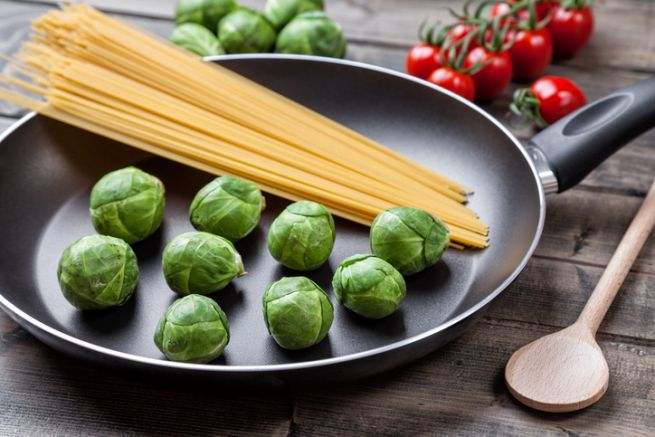

Forse vi suonerà un po’ curioso impiegare i cavolini di Bruxelles per un primo piatto, eppure vedrete che il sapore di questa ricetta vi lascerà davvero piacevolmente stupiti. In giro per il web troverete piatti che utilizzano essenzialmente i fusilli, ma secondo me l’ideale è la pasta lunga, soprattutto spaghetti o linguine. Ecco, ora è tutto pronto per preparare la nostra pasta al tonno e cavolini di Bruxelles.

Ingredients
===========

* 200gr di pasta lunga
* 350gr di cavolini di Bruxelles
* 80gr di tonno
* 2 spicchi d’aglio
* 2tbsp di concentrato di pomodoro
* 1 ciuffo di prezzemolo
* olio, sale e pepe

Preparation
===========

Cuocete al vapore i cavolini per una decina di minuti, poi tagliateli in 4, eliminate il picciolo e le foglie esterne e saltateli in un’ampia padella dove avrete riscaldato l’olio con l’aglio e portateli a cottura aggiustando di sale e di pepe.

Trascorsi 5 minuti, unite il concentrato di pomodoro, un po’ d’acqua per diluire e il tonno sgocciolato a pezzetti. Fate cuocere per 10 minuti ancora, poi ripassate in questo sughetto la pasta scolata al dente, polverizzate con il prezzemolo tritato e servite.

Notes
=====
