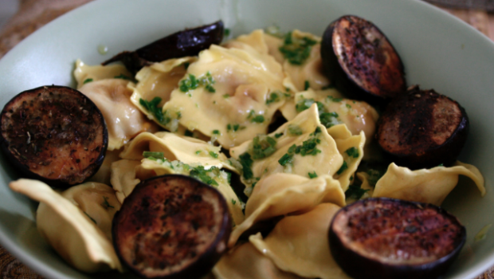

La Pasta con melanzane e ricotta è un primo piatto leggero ma allo stesso tempo sfizioso, indicato soprattutto per chi ha voglia di mangiare qualcosa di davvero gustoso, senza per questo rinunciare a tutti i sacrifici imposti dalla dieta.

La ricetta che vi voglio proporre oggi, infatti, oltre ad essere pronta in una manciata di minuti, si contraddistingue per il suo sapore fresco e per il suo profumo intenso e avvolgente. Ma scopriamola insieme.

Ingredients
===========

* 1 melanzana
* 3tbsp ricotta
* 200gr pasta
* 3 foglie di menta fresca
* sale, pepe, olio

Preparation
===========

Iniziamo la nostra ricetta partendo dalla melanzana: dopo averla lavata accuratamente sotto un getto di acqua corrente, asciugatela con un panno pulito da cucina, quindi privatela del picciolo e tagliatela a fette spesse circa mezzo centimetro. Riponete poi il tutto all'interno di una ciotolina con un paio di cucchiai di olio extra vergine di oliva, un pizzico di sale e pepe e le foglioline di menta fresche, quindi lasciate a riposare per almeno un'ora.

Nel frattempo, in una casseruola colma di acqua bollente e salata mettete a cuocere la pasta fino a raggiungere la cottura al dente. Una volta pronta, spegnete il fuoco e scolatela in modo da privarla dell'acqua in eccesso.

Trascorso il tempo indicato per la marginatura, trasferite il contenuto della ciotola all'interno di una padella antiaderente e tagliate le melanzane a pezzettini, quindi spadellate il tutto per qualche minuto.

Aggiungete infine anche la pasta e mescolate bene, quindi lasciate ad insaporire per un paio di minuti. Versate all'ultimo momento anche la ricotta fresca sbriciolata e aggiustate con un pizzico di sale e pepe se necessario. Servite ancora bollente.

Notes
=====
