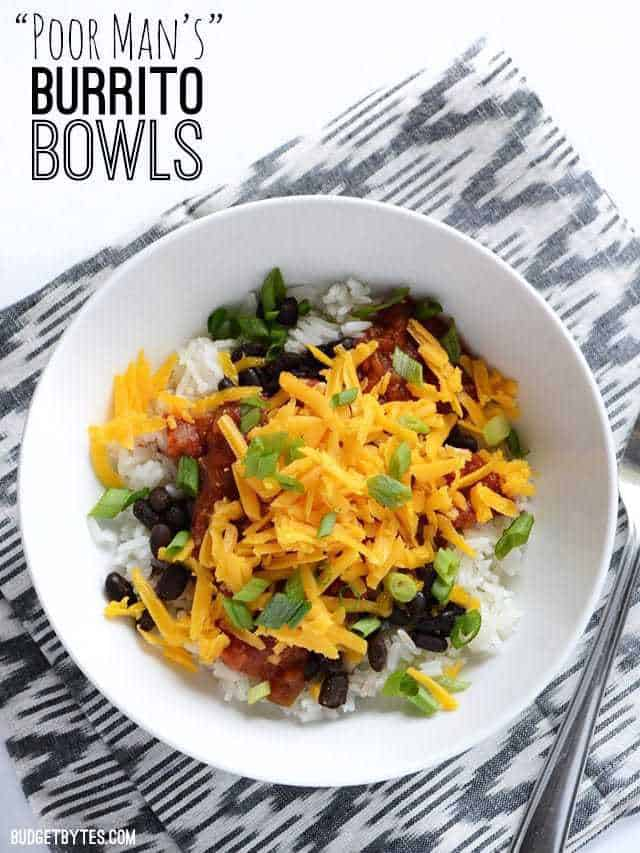

These filling and flavorful burrito bowls are insanely easy and cheap. Just a few simple ingredients come together to make a satisfying and quick meal.

Ingredients
===========

* 1,2kg cooked rice
* 400gr black beans
* 1/2tsp cumin
* 1/4tsp garlic powder
* Salt to taste
* 600ml salsa
* 150gr shredded cheese (cheddar or pepper jack)
* 1 bunch green onions

Preparation
===========

Cook the rice according to the package directions. While the rice is cooking, heat the black beans (undrained) in a small sauce pot, along with the cumin, garlic powder, and salt to taste (if needed). Slice the green onions and shred the cheese (if not pre-shredded).

Once the rice is cooked, build the bowls. Begin with one cup cooked rice, 100gr warm black beans, 200ml cup salsa, and 10gr shredded cheese.

Top with a few sliced green onions and serve.

Notes
=====
