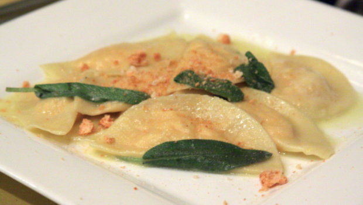

Ingredients
===========
    
Per la pasta dei ravioli:

* 200gr farina
* 2 uova
* Sale
    
Per il ripieno:

* 400gr fontina
* 300ml latte
* 15gr burro
* 20gr farina
* 2 tuorli

Per condire:

* Burro qb
* Salvia qb

Preparation
===========

Iniziamo la nostra ricetta partendo dalla fontina: dopo averla tagliata a dadini piccoli, mettetela in una ciotolina e lasciatela riposare a bagno con il latte.

Nel frattempo, all'interno di un pentolino sciogliete il burro insieme alla farina, continuando a mescolare in modo che non si formino grumi. Una volta ottenuto un composto omogeneo, incorporatevi il latte e, un po' alla volta, iniziate ad amalgamare anche la fontina.

Quando il formaggio si sarà sciolto completamente, spegnete la fiamma e versate all'interno della fonduta anche i tuorli, continuando a mescolare. Mettete poi da parte il composto e riponete in frigo in modo che si rapprenda.

Procedete intanto con la realizzazione della pasta fresca: iniziate ad impastare la farina, le uova e una presa di sale fino ad ottenere un panetto piuttosto omogeneo, che andrete a tirare con la macchina apposita fino a creare un foglio molto sottile che andrete ad adagiare sopra ad un piano da lavoro.

Prendete la fonduta, che ne frattempo si sarà solidificata, e iniziate a creare delle palline che andrete a riporre sopra al foglio di pasta distanti tra loro. Tagliate ora la pasta con la rotellina e chiudete il raviolo a metà, pressando i bordi con una forchetta in modo che rimangano ben sigillati.

Cuocete i vostri ravioli alla fonduta di formaggio all'interno di una casseruola dai bordi alti colma di acqua bollente e salata per qualche minuto. Servite i ravioli nei piatti da portata ancora bollenti con un po' di burro fuso e salvia.

Notes
=====
