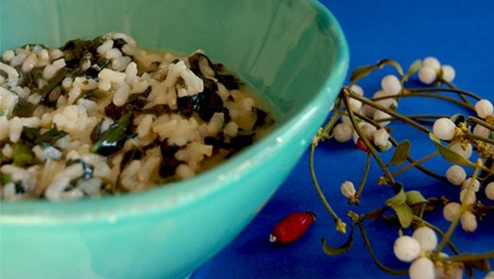

In vista dell'estate, e della conseguente ed inevitabile prova costume, delle ricette leggere ma gustose non possono che risultare bene accette. A questo proposito vi suggerisco quella del riso integrale con spinaci, una sorta di risotto cremoso e poco calorico. Ciò anche per via dell'assenza del burro nella mantecatura finale sostituito dallo yogurt greco.

Ingredients
===========

* 400gr di spinaci
* 320gr di riso integrale
* brodo vegetale qb
* 1 cipolla
* 100gr di yogurt greco
* sale e pepe
* olio di oliva qb

Preparation
===========

Affettare la cipolla e metterla ad appassire in un tegame con poco olio e acqua. Una volta morbida unire il riso e farlo tostare per un minuto, quindi iniziare ad aggiungere il brodo. Dopo appena cinque minuti di cottura unire gli spinaci affettati sottilmente e continuare a cuocere unendo man mano il brodo. A cottura ultimata spegnere la fiamma, aggiungere lo yogurt greco, il sale ed il pepe e mantecare qualche istante. Servire subito.

Notes
=====
