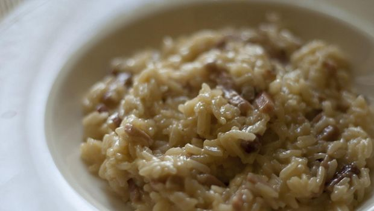

Alla ricerca di un primo piatto sfizioso da preparare per un’occasione particolare, mi sono imbattuta nella ricetta del risotto alla birra: riuscite a pensare a qualcosa di più accattivante?

Lo trovo perfetto da servire durante una cena con gli amici: è facile e veloce ma dalla resa deliziosa, proprio le caratteristiche che rendono un piatto insuperabile. Ecco come prepararlo seguendo questa ricetta.

Ingredients
===========

* 320gr di riso arborio
* 1 birra chiara
* 100gr di pancetta affumicata a cubetti
* brodo vegetale qb
* olio extra vergine di oliva qb
* 1 cipolla
* sale e pepe
* prezzemolo fresco tritato
* 40gr di burro
* 50gr di parmigiano

Preparation
===========

Affettare sottilmente la cipolla e metterla a soffriggere in una pentola con dell’olio caldo insieme alla pancetta tagliata a cubetti. Una volta rosolate entrambe unire il riso, farlo tostare bene, quindi aggiungere la birra e farla sfumare. Appena si sarà assorbita iniziare ad unire il brodo vegetale, un mestolo alla volta fino a portare il riso a cottura. Appena cotto il riso togliere la pentola dal fornello, unire il burro, il parmigiano ed il prezzemolo e mantecare bene il tutto. Servire il risotto ben caldo.

Notes
=====
