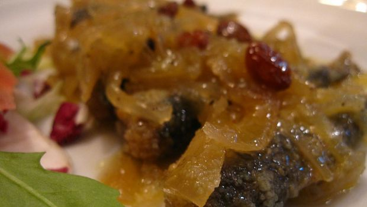

Le alici ripiene, e non, sono un punto di forza della cucina siciliana. Ogni città le prepara a modo suo: noi oggi abbiamo scelto di proporvi una ricetta che normalmente si preparerebbe con le sarde (troppo grasse per i miei gusti) e che è originaria di Palermo, anche se la tradizione vorrebbe fossero cotte in forno: una preparazione dal nome originale, u beccaficu, che richiama il nome di un piccolo uccello che in sicilia si mangia ripieno… ebbene sì, delle sue viscere.

Ingredients
===========

* 1kg di alici fresche
* 20gr di pecorino grattugiato
* 2 uova
* 2 spicchi d’aglio
* 10gr di pangrattato
* 1 ciuffo di prezzemolo
* olio, sale e pepe q.b.

Preparation
===========

Pulite le alici privandole della testa e della lisca in modo che i filetti risultino aperti a metà. A parte mescolate il pangrattato con prezzemolo e aglio tritati, sale e pepe e un uovo. Adagiate un po’ di impasto su un filetto, poi coprite con l’altro e passate sui bordi un po’ del restante uovo sbattuto in modo da sigillare il più possibile. Friggete le alici così riempite in padella, facendo attenzione quando le girate, e servitele calde cosparse di origano e accompagnate da fettine di limone.

Notes
=====
