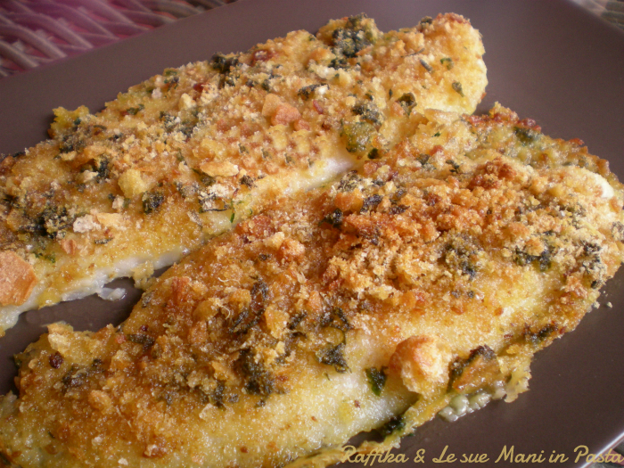

I filetti di pangasio gratinati sono un ottimo secondo di pesce, veloce e facile da preparare ma soprattutto economico. Io ho utilizzato una confezione di filetti di pangasio surgelata, acquistata tra l’altro in offerta al supermercato, quindi non ho dovuto neanche pulire il pesce. E’ un piatto molto gustoso, perché arricchito dal mio “mix“, che dà molto sapore a tante mie ricette.

Il pangasio è un pesce d’acqua dolce, di origine asiatica, dalla polpa bianca o rosa chiaro, praticamente privo di lische, quindi molto adatto ai bambini. E’ indicato per diete a basso contenuto calorico e contiene Omega 3 e Omega 6, che aiutano a ridurre il colesterolo. Grazie al suo basso costo, il suo consumo è in crescente aumento tanto che questo pesce sta diventando uno dei protagonisti della ristorazione collettiva.

Ingredients
===========

* 8 filetti di pangasio (800gr circa)
* 150gr di pangrattato
* 60gr di grana padano
* 1 spicchio d’aglio
* un ciuffetto di prezzemolo
* sale e pepe q.b.
* olio evo q.b.

Preparation
===========

Per preparare i filetti di pangasio gratinati cominciamo col preparare il mio “mix“. Lavate il prezzemolo, sbucciate l’aglio e realizzatene un trito. In una ciotola mettete il pangrattato, il grana padano grattugiato, il sale, il pepe, il prezzemolo e l’aglio tritati e mischiate il tutto.

Dopo aver scongelato i filetti di pangasio in frigorifero, precedentemente o se avete dimenticato di farlo, potete metterli sotto l’acqua corrente fredda, dopo averli preventivamente inseriti in un sacchetto per alimenti da freezer e asciugateli con della carta assorbente da cucina.

Rivestite di carta forno una leccarda, adagiatevi i filetti di pangasio e ricopriteli, completamente di “mix“, aiutandovi con un cucchiaio.

Irrorate ogni filetto con un filo di olio e infornate, in forno già caldo, a 200° per circa 20 minuti. Gli ultimi 2 minuti passate alla funzione grill del vostro forno e lasciateli gratinare ben bene. Servite i vostri filetti di pangasio gratinati caldi e magari accompagnandoli con una bella insalata mista.

Notes
=====
