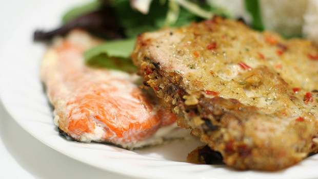

Ingredients
===========

* 500gr di pesce spada
* 100gr di pangrattato
* 50ml di vino bianco
* olio extravergine di oliva qb
* 4-5 pomodori ciliegino
* 1 spicchio di aglio
* 1 rametto di timo
* sale e pepe

Preparation
===========

Tritate le foglie di timo con lo spicchio di aglio. Affettare sottilmente i pomodorini. Versare il pangrattato in una ciotola quindi unire l'olio, il vino, gli aromi, i pomodorini affettati e del sale. Mescolare bene: si otterrà un composto omogeneo fatto di briciole. Porre i tranci di pesce in una teglia rivestita di carta forno, ungerli con poco olio quindi coprire con il composto di pangrattato. Irrorare ancora con poco olio e cuocere in forno caldo a 180 °C per circa 20 minuti.

Notes
=====
