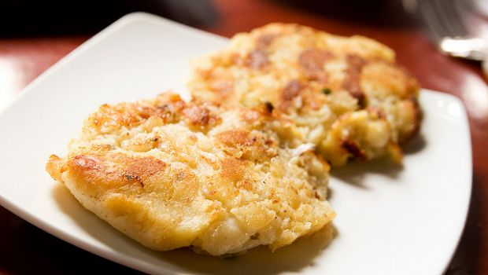

In Portogallo il baccalà è qualcosa di più di un piatto tipico… è un’istituzione! Qui da noi, invece, salvo alcune regioni che lo annoverano tra i loro piatti tradizionali, stenta ad affermarsi, forse per il suo gusto particolare apprezzato non proprio da tutti. Vi invito, invece, a provare come lo fanno lì, con preparazioni a base di latte che ne smorzano un po’ il sapore. Questa è una ricetta particolare: le polpette di baccalà alla portoghese.

Ingredients
===========

* 500gr di baccalà già ammollato
* 500ml d’olio
* 3 spicchi d’aglio
* 1 peperoncino rosso
* 4 fette di pane
* latte q.b.
* prezzemolo
* la scorza di 1 limone bio

Preparation
===========

Squamate il baccalà, mettetelo in un tegame coperto d’acqua e fatelo sobbollire per 10 minuti, quindi scolatelo e sminuzzatelo tenendo da parte un po’ dell’acqua di cottura. Soffriggete aglio e peperoncino, quindi passatevi il baccalà tritato mentre starete facendo ammollare il pane nel latte. Unite sul fuoco l’acqua di cottura del baccalà, poi strizzate per bene il pane, tritatelo e unitelo all’impasto a fuoco spento assieme alla scorza di limone e al prezzemolo tritato. Con questo formate delle palline rotonde oppure appena schiacciate e friggetele in abbondante olio bollente. Sgocciolatele su carta assorbente e servite calde.

Notes
=====
