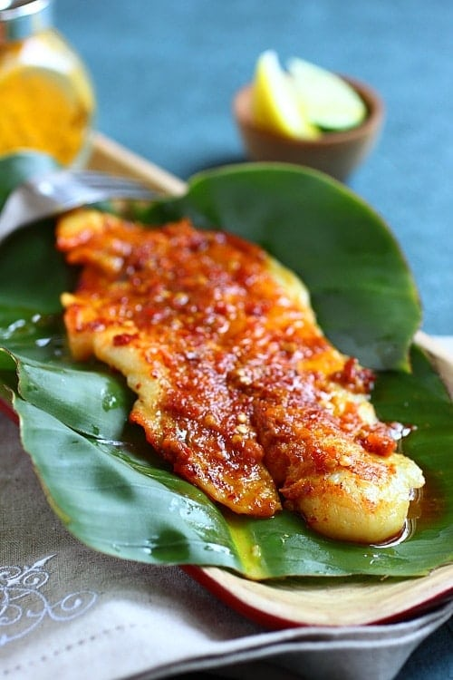

Grilled fish is very popular in Malaysia. It’s called ikan panggang or ikan 
bakar and sold by street vendors or in restaurants.

This fish grill is usually wrapped with layers of banana leaves, marinated with 
spice-laden marinade called sambal (spice paste) and grilled over charcoal fire 
with other seafood such as grilled oysters.

This is probably one of the best grilled fish recipes ever, with juicy, tender, 
moist fish with complex flavors. The banana leaves impart intense aroma and 
earthy fragrance to the fish.

Ingredients
===========

* 500gr fish fillet or whole fish (for example: red snapper)

Grilled Fish Sambal:

* 170gr fresh red chilies (seeded and cut into small pieces)
* 120gr shallots
* 1tbsp toasted belacan (Malaysian shrimp paste)
* 2 lemongrass (cut into thin slices)
* 4tbsp oil
* 1/4tsp salt (or to taste)
* 2tsp fish sauce to taste
* 2.5tsp sugar (or to taste)
* 1/4tsp turmeric powder
* 1/2 lime or 1 calamansi lime (extract the juice)

Sambal Belacan and Sliced Shallots Condiment:

* tamarind pulp (ping pong ball size)
* 8tbsp water
* 3 fresh red chilies (seeded)
* 2 bird's eye chilies (seeded)
* 1tsp toasted belacan
* sugar to taste
* salt to taste
* 2 shallots (thinly sliced)

Preparation
===========

Grilled Fish Sambal:

1. Prepare the sambal by grinding chilies, shallots, belacan and lemongrass in a food processor. Make sure the sambal paste is well blended and smooth.
2. Heat up a wok and add the oil. "Tumis” (stir-fry) the sambal paste until 
   aromatic or when the oil separates from the sambal paste. Add the 
   seasonings: salt, fish sauce and sugar and do a quick stirs, dish out and 
   set aside.

Sambal Belacan and Sliced Shallots Condiment:

1. Soak the tamarind pulp with the water for 15 minutes and extract the juice. In a mortar and pestle or food processor, pound/blend the red chilies, bird’s eye chilies and toasted belacan. Add tamarind juice, sugar, salt, and sliced shallots to the sambal. Stir well and set aside.

Grilling the Fish:

1. Lay a few sheets of banana leaves and grease the surface of the banana leaves with some oil. Lay the fish fillet on top of the banana leaves and rub the turmeric powder on both sides of the fish. Add about 2 - 3 tablespoons of sambal on top of the fish. Spread the sambal evenly. Drizzle the lime juice on the fish.
2. Place the fish on top of the grill (upper rack with indirect heat) and cover 
   the grill. Wait for 8 minutes or so (depending on the heat) and flip the 
   fish over to the other side.
3. Add 2 - 3 more tablespoons of sambal on the other side of the fish. Cook for 
   another 8 minutes, or until the fish is cooked.
4. Transfer the fish and the banana leaves to the lower rack and grill for a 
   couple of minutes with direct heat, or when you smell the sweet aroma of 
   burnt banana leaves.
5. Transfer out and serve immediately with sambal belacan and sliced shallots 
   condiment.

Notes
=====
