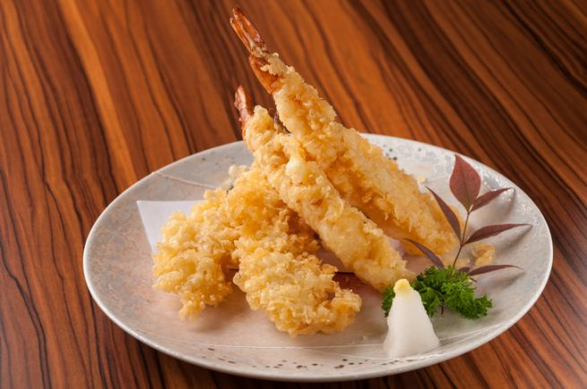

Una variante della classica ricetta che viene dal Giappone è la tempura di gamberi e mandorle, la tradizionale maniera di friggere in modo tutto sommato leggero. Il segreto, ovviamente, non è solo nella pastella, ma anche nell’utilizzo di oli vegetali al punto giusto, di arachidi se vi è più comodo, oppure di soia per rispettare i dettami orientali. Infine potete provare anche a sostituire le mandorle con le nocciole o addirittura con i pistacchi per un sapore più nostrano.

Ingredients
===========

* 600gr di gamberi
* 150gr di farina
* 200gr di mandorle in lamelle
* 1l d’olio di arachidi o di soia
* acqua e ghiaccio q.b.

Preparation
===========

Sgusciate i gamberi lasciando le code, poi puliteli bene eliminando il filo nero e batteteli leggermente in modo che si allunghino. Metteteli da parte conservandoli in frigo in una ciotola coperta da pellicola.

Intanto preparate la pastella miscelando la farina con sufficiente acqua e ghiaccio per raggiungere la consistenza ideale, quindi passatevi i gamberi avendo cura che siano ricoperti in tutti i punti, quindi passateli nelle lamelle di mandorle che si attaccheranno all’istante e friggeteli in abbondante olio bollente.

Notes
=====
