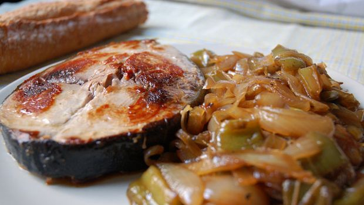

Il tonno con cipollata alla siciliana è un piatto particolarmente sfizioso dedicato agli amanti dell’agrodolce. Sapore ricorrente nella cucina siciliana, distintivo di numerosi piatti tipici dell’isola. Anche in questo caso da vita ad una pietanza assolutamente irresistibile. Inutile sottolineare come del pesce fresco garantisca un risultato perfetto.

A completare il piatto la cipollata, altro piatto tipico e povero della tradizione. Si tratta di un contorno essenziale che si gusta anch’esso freddo o al massimo a temperatura ambiente e che si presta ad accompagnare secondi piatti a base di carne o di pesce, come in questo caso. Si consiglia di preparare il tonno con cipollata il giorno precedente: trascorse diverse ore raggiunge il massimo del sapore in quanto gli ingredienti avranno avuto modo di fondersi perfettamente.

Ingredients
===========

* 800gr di tonno
* farina qb
* olio extravergine d’oliva
* sale qb
* 3 cipolle grosse
* 100ml di aceto bianco
* 1tsp di zucchero

Preparation
===========

Tagliare il tonno a fette abbastanza spesse e passarle nella farina . Farle rosolare in un tegame con abbondante olio caldo. Adesso salarle, prelevarle dalla padella e metterle a scolare su carta assorbente da cucina, mantenendole al caldo. Tagliare a fette le cipolle e friggerle nella padella precedente. Appena dorate sfumarle con l’aceto nel quale avrete sciolto lo zucchero. Aggiungere quindi le fette di tonno cotte precedetntemente e fare insaporire per qualche minuto. Servire freddo.

Notes
=====
