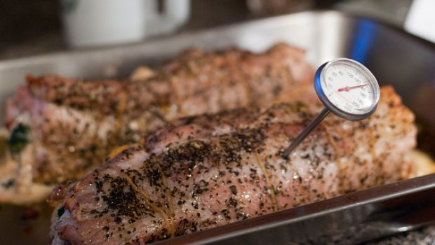

Ecco un secondo piatto ricco adatto per le grandi occasioni in generale e per il pranzo della domenica in particolare. Gli arrosti sono delle preparazioni di per se non difficili, ma richiedono dei tempi di cottura che durante la settimana non è facile trovare. L’arrosto di maiale con castagne può essere considerato a tutti gli effetti un piatto di stagione. Risulta semplice ma dalla resa impeccabile.

Basta arrotolare la carne nella pancetta ed adagiarla nella teglia con il resto degli ingredienti, castagne comprese. A proposito di queste ultime potreste utilizzare anche quelle secche, in questo caso bisognerà metterle preventivamente a bagno in acqua almeno 30 minuti prima dell’inizio della preparazione. Ecco come realizzare l’arrosto di maiale con castagne, mentre se siete in cerca di varianti provate quello al latte e quello al forno con le patate, due classici per il pranzo in famiglia.

Ingredients
===========

* 1kg di lombo di maiale disossato
* 100gr di pancetta a fette
* 2 spicchi di aglio
* olio extra vergine di oliva
* 250gr di castagne già cotte
* 2 foglie di alloro
* sale
* pepe nero macinato fresco

Preparation
===========

Posizionare la carne di maiale sul piano da lavoro ed avvolgerla con le fettine di pancetta. Legarla con dello spago da cucina. Adesso posizionare la carne al centro di una teglia da forno. Unire gli spicchi di aglio tritati grossolanamente, l’alloro, regolare di sale e pepe e irrorare con poco olio. Unire anche le castagne e trasferire in forno caldo a 180 °C per circa 40 minuti. Durante la cottura controllare spesso lo stato della preparazione. Se si rendesse necessario bagnare con poco brodo. Servire tagliato a fette accompagnate dalle castagne e dal sugo di cottura.

Notes
=====
