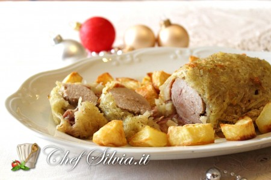

L' Arrosto in crosta di patate è un secondo piatto gustoso che si realizza facilmente in poco tempo. Un arrosto molto saporito che in questa versione diventa un piatto raffinato adatto alle grandi occasioni come quella del Natale. Se state cercando, per una cena o un pranzo importante come quello di Natale un'alternativa valida al solito roast-beef vi consiglio di provare la ricetta dell'arrosto in crosta di patate, un ottimo piatto per fare bella figura con i vostri commensali.

Ingredients
===========

* 1 filetto di maiale da circa 1,2kg
* 1 scalogno
* 1 carota
* 1 costa di sedano
* 1 mazzetto di prezzemolo
* 3 foglie di salvia
* 3tbsp di olio extravergine d'oliva
* mezzo bicchiere di vino bianco
* 5 patate di media grandezza
* sale e pepe q.b.
* 120gr di prosciutto crudo a fette
* 150ml di brodo di carne

Preparation
===========

Salate e pepate il filetto,infarinatelo e fatelo rosolare da tutti i lati in una casseruola con 3 cucchiai di olio insieme ad un trito finissimo di carota, sedano, scalogno, prezzemolo e salvia. Fatelo cuocere circa 40 minuti circa bagnando a metà cottura con il vino e , se necessario, aggiungete il brodo.

Nel frattempo sbucciate le patate, affettatele sottilmente con una mandolina o una grattugia dai fori grandi fino ad ottenere tanti filetti sottili. Disponete al centro di un foglio di carta forno uno strato di patate grande quanto il filetto, ricopritele con le fette di prosciutto e adagiatevi sopra la carne scolata del fondo di cottura.

Con l'aiuto della carta da forno avvolgete la carne nel prosciutto e nelle patate fino a ricoprire interamente il filetto, non serviranno uova perchè le patate in cottura rilasceranno amido e aderiranno perfettamente alla carne.

Aprite delicatamente la carta forno dove è avvolto l'arrosto e aiutandovi con la carta stessa trasferite la carne in una pirofila(la carta servirà per non far attaccare la crosta di patate al fondo della pentola) Spennellate delicatamente la superficie delle patate con pochissimo olio, aggiungete sale, pepe e cuocete in forno per 15 minuti a 200 gradi terminando la cottura (15 minuti circa) sotto il grill del forno fin quando la superficie delle patate risulterà ben dorata.

Nel frattempo passate il fondo di cottura con frullatore ad immersione aggiungendo, se necessario, 1 cucchiaio di fecola di patate per addensare la salsa. Servite il vostro Arrosto in crosta di patate a fette irrorandolo con la salsa ottenuta con il fondo di cottura.

Consiglio: se l'arrosto viene cotto avvolto nella carta le patate svilupperanno un'antipatica acqua di vegetazione che le farà lessare e non gratinare (la carta forno dovrà essere utilizzata solo in fase di preparazione quando risulterà indispensabile per far aderire alla carne i filetti di patate crude)

Notes
=====
