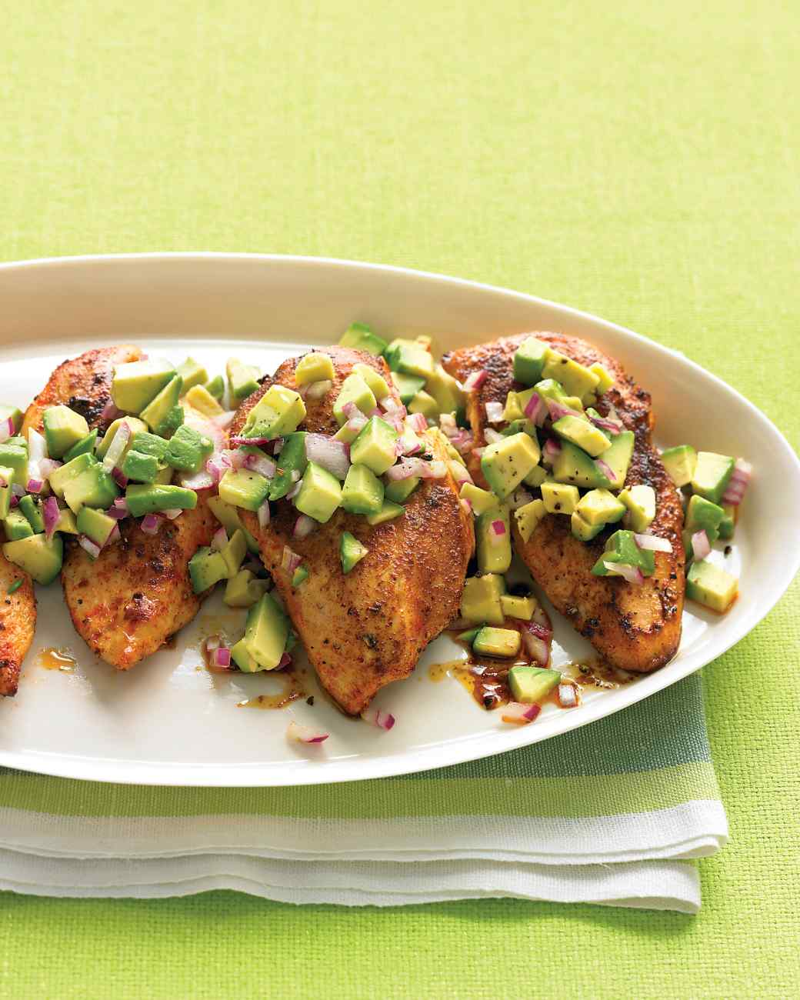

Ingredients
===========

* 1/4tsp cayenne pepper
* 4 boneless, skinless chicken breast halves
* 2tbsp olive oil
* 1 medium red onion, finely diced
* 2tbsp fresh lime juice
* 1 Hass avocado, pitted and cut into chunks
* Coarse salt and ground pepper

Preparation
===========

In a small bowl, combine 1 teaspoon salt, 1/4 teaspoon pepper, and cayenne; rub all over chicken.

In a large skillet, heat oil over medium. Add chicken, and cook until browned on the outside and opaque throughout, 8 to 10 minutes per side.

Meanwhile, in a medium bowl, combine onion and lime juice; set aside. Just before serving, fold avocado chunks into onion mixture; season with salt and pepper. Serve chicken topped with salsa.

Notes
=====
