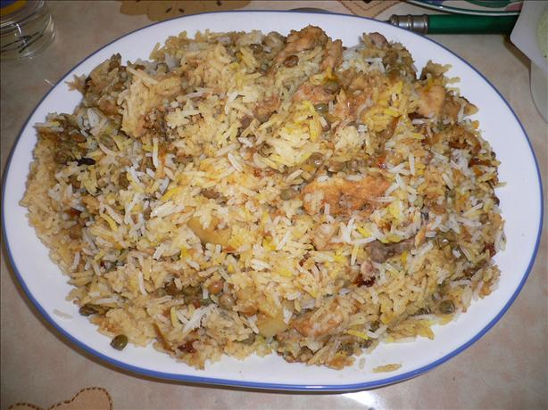

Ingredients
===========

* 1 (around 1,5kg) chicken, washed and disjointed
* 250gr black lentils
* 250gr rice
* 2 cinnamon sticks
* 4 cardamom
* 1tsp cumin
* 4 green chilies (slit)
* 150ml yoghurt
* 2tbsp fresh tomatoes (grated or pureed)
* 1tbsp lemon juice
* 2 sprigs mint
* 1/4tsp saffron
* 1/4tsp turmeric
* 1tsp salt
* 1tbsp coriander
* 1 1/2 red chilies
* 6 small potatoes
* 3 hard-boiled eggs
* 250ml oil
* 2 onions
* 1 1/2tsp ginger
* 1 1/2tsp garlic

Preparation
===========

Keep some saffron aside for tinting and 3 or 4 tbsp of the cooked rice. This must be spread on top of the finished rice, in streaks.

Fry onions in oil to a pale golden colour. Drain and cool. Leave aside 1 tablespoon of the fried onions and crush the rest coarsely. Wash and drain disjointed chicken. Place in large bowl. Add saffron and smear ginger/ garlic over meat pieces by tossing it around mean, with spoon. Add yoghurt, tomatoes, spices, fried onions, whole green chillies, sprigs of mint and allow to marinate for at least 1 hour.

Meanwhile, boil black lentils in salted water until finished. Drain off in colander.

Boil rice with 2 cardamom and 1 piece cinnamon. The rest of the elachi, etc. must be added to marinating the meat. Rice must be drained when only half done.

Fry potatoes to light yellow colour in oil used for frying onions. Remove from oil and set aside.

In large flat bottomed pot (2-3 litre size) put in oil that was used for frying,plus half cup of oil. Sprinkle a handful of rice and black lentils over the bottom. Now arrange the marinating chicken and spices carefully over the bottom of the pot. Now spread the black lentils over the chiekn, then the potatoes and then half of the rice. Place peeled hard boiled eggs over rice. Now spread the rest of rice over the eggs. Place the remaining saffron over the top of the rice.

Decorate with left- over fried onions, and sprinkle the rest of the oil and half a cup of cold water over the top. Close and seal the pot tightly. Place over high heat for 5 minutes and as soon as it starts sizzling, lower heat and let simmer for 1 hour. By this time all the moisture should have evaporated.

Notes
=====
