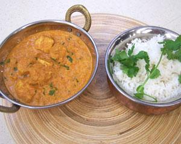

Ingredients
===========

* 100ml plain yogurt
* 1 lime, juice only
* 2tsp turmeric
* 2tsp chilli powder
* 2tsp ground coriander seeds
* 1tsp ground cumin
* 2tsp grated fresh ginger
* 3 cloves garlic, crushed
* 4 x 150gr chicken breasts
* 60ml olive oil
* 2 onions, finely chopped
* 2 inch piece of ginger
* 2tsp chilli powder
* 1tsp coriander seeds, ground
* 1 tsp ground cumin
* 2 tomatoes, roughly chopped
* 4tbsp tomato purée
* 1tsp salt
* 250ml water
* 100ml double cream
* coriander, to garnish
* basmati rice

Preparation
===========

For the marinade: in a large bowl mix together the marinade ingredients. Add the chicken to the bowl and coat the meat, making sure that each piece is well covered with the marinade. Cover the bowl with cling film and leave to marinate in the fridge overnight. For the tikka masala: heat the oil in a pan or casserole, add the onion and lightly fry until golden. Add the ginger, chilli powder, coriander seeds and cumin and cook for a further 30 seconds. Stir in the garlic and cook for 30 seconds, then add the tomatoes and cook for another 1-2 minutes. Reduce the heat and stir in the tomato purée and leave to simmer for 3-4 minutes. Transfer the marinated chicken into the pan and mix well to coat with the sauce. Add the water. Cover with a lid and leave to simmer over a low heat for 15-20 minutes, stirring occasionally. Take off the lid and stir in the cream. Add salt to taste and leave to simmer for a further 5 minutes, until the chicken is cooked through. Serve with boiled basmati rice and garnish with a sprinkling of coriander leaves.

Notes
=====
