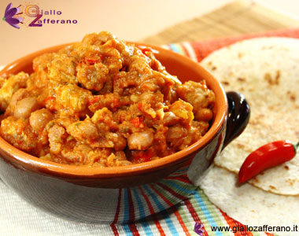

Il chili con carne è un piatto tipico messicano formato principalmente da carne tagliata a cubetti e fagioli rossi (o borlotti) cotti assieme ad altri ingredienti quali: peperoni, cipolle, aglio, spezie e pomodori.

Il chili con carne viene servito assieme a tortillas di farina calde o riso alla messicana e accompagnato da crema di fagioli.

Ingredients
===========

* 1 Aglio
* 150ml Brodo di manzo
* 1 pizzico Cannella in polvere
* 250gr Carne bovina, polpa di manzo
* 250gr Carne di suino, polpa di maiale
* 100gr Cipolla
* 1 mazzetto Coriandolo fresco
* 1/4tsp polvere di Cumino
* 250gr Fagioli rossi (o borlotti) in scatola
* 5tbsp Olio di oliva extravergine
* Pepe nero macinato a piacere
* 1 Peperoncino fresco piccante
* 1 Peperone rosso
* 1 Peperone giallo
* 200gr polpa di pomodori
* Sale q.b.

Preparation
===========

Per preparare il chili, tagliate la polpa di manzo e di maiale a cubetti; mondate la cipolla e l’aglio quindi tritateli finemente; lavate il peperone, tagliatelo in due, eliminate i semi e i filamenti interni e tagliatelo a quadretti. Eliminate i semi dal peperoncino e tagliatelo finemente.

Proseguendo nella preparazione del chili, prendete un tegame e disponetevi l’olio, la cipolla, l’aglio, il peperoncino e il peperone; fate soffriggere gli ingredienti assieme alla carne per 10 minuti, poi aggiungete la polpa di pomodoro, il coriandolo, il cumino, la cannella, il pepe nero e il sale, quindi lasciate cuocere per circa 25 minuti aggiungendo, qualora serva, il brodo di manzo (in questa fase potete aggiungere, volendo, la scorza grattugiata di 1 lime).

Ecco che il vostro chili è pronto.

Trascorso il tempo necessario, unite i fagioli e fate addensare la preparazione, poi spegnete il fuoco.

Notes
=====

Volendo, in cottura potete aggiungere al chili con carne un la buccia di 1 lime grattugiata. Accompagnate il chili con carne con tortillas di farina calde o riso alla messicana; arricchite la presentazione della pietanza aggiungendo qualche ciotolina di panna acida o crema di fagioli; guarnite il chili con carne con delle foglie di coriandolo fresco.
