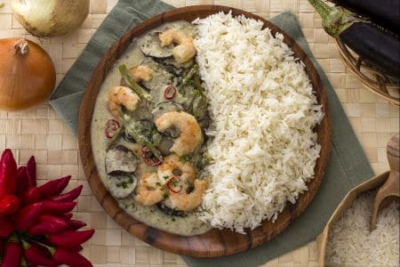

Il curry verde Thai è un delizioso piatto unico thailandese, composto da manzo e verdure che vengono cotte in un saporito latte di cocco aromatizzato al curry verde.

I curry thailandesi sono piatti a base di differenti paste di curry (verde, gialla o rossa), che vengono diluite in latte di cocco e acqua e arricchite con verdure e carne, pesce o tofu. Potete acquistare la pasta di curry verde già pronta nei negozi etnici o nei supermercati più forniti, oppure prepararla in casa seguendo la nostra ricetta.Alcuni degli ingredienti tradizionali della cucina Thai sono difficilmente reperibili in Italia (foglie di Kaffir Lime, salsa di pesce Thai), per questo abbiamo cercato di indicare delle alternative per sostituirli.

Ingredients
===========

Ingredienti per la pasta di curry verde

* 6 Peperoncino verde piccante
* 4cm di radice di Zenzero fresco 
* 1 Scalogno
* 1tsp Sale fino
* 1tsp Semi di coriandolo
* 1tsp Semi di cumino
* 2 spicchi Aglio
* 2 Lemongrass (citronella)
* 3 foglie Lime (Kaffir lime)

Per il curry verde Thai

* 400gr Manzo scamone
* 1 Melanzana lunga
* 150gr Fagiolini
* 1 spicchio Aglio
* 3cm di radice di Zenzero fresco
* 1tsp Zucchero
* 600ml Latte di cocco
* 300ml Acqua
* 2tbsp Olio di semi di girasole
* 1 Peperoncino fresco
* 1 ciuffo di Coriandolo
* 2tbsp Salsa di soia (o di pesce Thai)
* 1 Cipolla

Preparation
===========

Per preparare il curry verde Thai iniziate procurandovi della pasta di curry verde thailandese, se non la trovate nei negozi di prodotti etnici potete prepararla in casa. Affettate finemente i peperoncini piccanti privati dei semini interni, tritate l’aglio e lo scalogno, tostate in un padellino i semi di coriandolo e i semi di cumino per qualche minuto, tritate il lemongrass (se non lo trovate grattugiate la scorza di due lime) e lo zenzero precedentemente pelato. Ammorbidite in acqua tiepida le foglie di kaffir lime essicate (potete omettere questo ingrediente se non lo trovate). 

Ponete i semi di coriandolo e di cumino in un mortaio e schiacciateli con il pestello, poi aggiungete tutti gli altri ingredienti e 1 cucchiaino di sale, pestando fino ad ottenere una poltiglia (potete fare questa operazione anche al mixer). Mettete da parte la pasta di curry verde Thai. Pelate la cipolla e affettatela grossolanamente, lavate la melanzana e affettatela a fette di circa 1 cm di spessore, private i fagiolini verdi delle estremità e tagliateli a metà.

Tagliate la carne di manzo a fettine piuttosto sottili. Tritate la radice di zenzero pelata e lo spicchio d’aglio, ponetelo in un wok con l’olio di semi di girasole e quando sarà ben caldo ponete la carne di manzo e fatela rosolare bene su tutti i lati. Toglietela poi dal wok e conservatela al caldo. Aggiungete quindi nello stesso wok la pasta di curry verde precedentemente preparata (se la comprate già pronta utilizzatene 3 cucchiai abbondanti), fatela rosolare per pochi secondi e aggiungete il latte di cocco e l’acqua, quando il latte di cocco sobbollirà aggiungete le verdure. Incorporate poi la salsa di soya (o la salsa Thai di pesce) e lo zucchero.

Quando le verdure saranno morbide aggiungete la carne di manzo e scaldatela per pochi minuti. In ultimo aggiungete un peperoncino rosso affettato e foglie di coriandolo fresco. Il curry Thai deve risultare molto brodoso e quindi è l’ideale da servire con del riso Jasmine bollito o cotto pilaf.
Il suo sapore deve avere un equilibrio tra il dolce del latte di cocco e dello zucchero, il salato della salsa di soya e la freschezza dello zenzero e del lemongrass; se uno dei sapori dovesse eccessivamente prevalere aggiustatelo aggiungendo ulteriore salsa di soya, zucchero o scorza di lime.

Notes
=====

Potete conservare il curry verde Thai in frigorifero per 1-2 giorni coperto con pellicola trasparente.

Potete congelare la preparazione se avete utilizzato ingredienti freschi non decongelati.

Potete realizzare questa ricetta utilizzando del pollo o dei gamberi al posto della carne di manzo. Nel caso del pollo saltate il passaggio 10 e introducete direttamente i pezzetti di pollo nel latte di cocco dopo le verdure. Nel caso dei gamberi aggiungeteli 5 minuti prima della fine della cottura, si cuoceranno in poco tempo!
