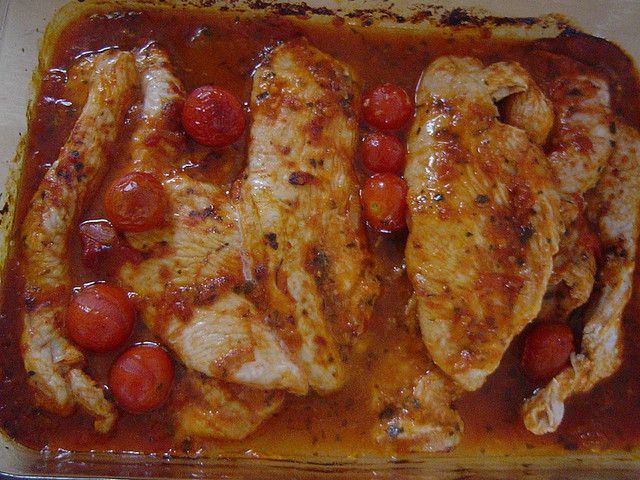

La Fesa di tacchino è uno di quei tagli di carne che viene spesso utilizzato in cucina soprattutto da chi sta seguendo una dieta dimagrante, ma anche da chi vuole rimanere leggero, senza per questo rinunciare al gusto.

La ricetta che andiamo a scorpire oggi riguarda la preparazione della Fesa di tacchino ai pomodori secchi, un secondo piatto a base di carne semplice e sfizioso, perfetto da abbinare ad un contorno a base di verdure cure o cotte.

Ingredients
===========

* 400gr fesa di tacchino
* pomodori secchi, una manciata
* timo
* maggiorana
* sale e pepe
* olio

Preparation
===========

Iniziamo la nostra ricetta versando all'interno di una padella abbastanza capiente un filo di olio extra vergine di oliva e, una volta caldo, anche le fettine di fesa di tacchino.

Aggiustate con una presa di sale e una spolverata generosa di timo e maggiorana, quindi proseguite con la cottura a fiamma dolce. Nel frattempo, tagliate i pomodori secchi a striscioline molto sottili che andrete a versare nella padella.

Cuocete la carne in modo uniforme da entrambi i lati, facendo attenzione che non si attacchi (in questo caso sfumate con un po' di vino) e che diventi di un ben colore dorato in superficie prima di servire.

Notes
=====
