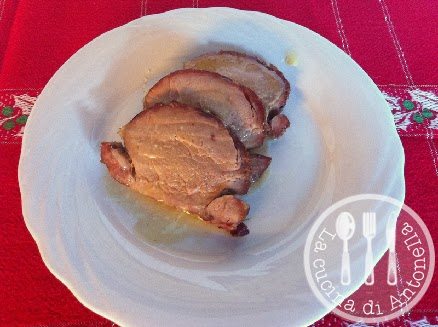

Questo è un secondo piatto un pò particolare, per chi ama l'agrodolce. Adatto per occasione importante come un pranzo di Natale. Facile da fare e il risultato è ottimo. Di solito viene servito con un contorno agrodolce ma credetemi un purè di patate o delle spinaci al burro lo accompagnano divinamente.

Ingredients
===========

* 500gr filetto di maiale
* una noce di burro
* olio evo
* sale 
* aglio
* rosmarino e salvia
* 1 bicchierino di brandy
* 1tbsp abbondante zucchero di canna
* 1tbsp miele millefiori

Preparation
===========

Prepariamo il pezzo di carne scartando l'eventuale grasso, saliamolo bene.

In una pentola mettiamo l'olio evo, la noce di burro, l'aglio tagliato a pezzi, il rosmarino e la salvia.

Rosolate bene la carne girandola affinchè si colorisca da tutte le parti.

Quando sara' ben rosolato bagnatelo con un bicchierino di brandy e lasciatelo evaporare.
Cucinatelo a fuoco moderato per una ventina di minuti e se serve bagnatelo con un pò di brodo.
Ora mettiamo il pezzo di carne in una teglia da forno , cospargetelo con il miele e lo zucchero di canna.

Mettere in forno a 200 gradi per 15/20 minuti . Tagliatelo a fettine non molto grosse e irroratelo con quel pò di sughetto e servitelo.

Notes
=====
