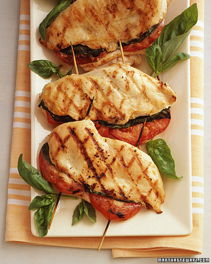

Ingredients
===========

* 4 boneless, skinless chicken breast halves
* 1/2tsp coarse salt
* Freshly ground pepper
* 2 garlic cloves, minced
* 1tbsp extra-virgin olive oil
* 12 fresh basil leaves, plus more for garnish
* 2 beefsteak tomatoes

Preparation
===========

1) Butterfly chicken breasts: Put halves on a cutting board, smooth sides down, with the pointed ends facing you. Starting on one long side, cut breasts almost in half horizontally (stop about 1/2 inch before reaching the opposite side). Open cut breasts like a book. Sprinkle each piece all over with 1/8 teaspoon salt; season with pepper. Transfer to a plate, and coat both sides with garlic and oil. Let stand 30 minutes.

2) Heat a grill or grill pan until medium-hot. Place 3 basil leaves on the bottom half of each opened chicken breast; top each with 2 slices tomato. Fold over other half of chicken breast, and secure with two toothpicks or short skewers.

3) Grill chicken breasts, turning once, until golden brown on both sides and no longer pink in the center, about 15 minutes. Place on a clean serving platter; garnish with basil. If desired, remove toothpicks or skewers before serving.

Notes
=====
