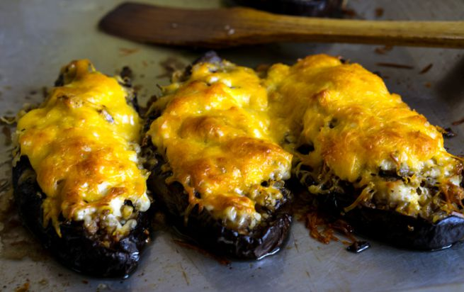

Una delle ricette estive più apprezzate è quella che vuole le melanzane ripiene di riso e carne. Trattasi di un piatto unico a tutti gli effetti contenendo proteine, carboidrati e verdure a volontà e, per tale motivo, perfetto per un pranzo nell'ambito del quale non si vogliano passare ore in cucina.

Così come le melanzane ripiene di riso e mozzarella, adatte ai vegetariani, anche queste solitamente piacciono a tutti. In quanto alla carne potrete optare per un mix tra vitello, pollo e maiale, o sceglierne un solo tipo, a seconda della disponibilità del momento.

Le melanzane ripiene di riso al forno che ne vengono fuori sono ottime anche il giorno dopo: si può tranquillamente affermare che acquistino gusto.

Trattasi, in fin dei conti, di melanzane ripiene di riso in bianco che potrete, comunque, arricchire sia con dei pomodorini affettati che con della polpa di pomodoro. Buon appetito!
This would be the description of the recipe. Any info or history about the recipe goes here

Ingredients
===========

* 4 melanzane lunghe
* 120gr di riso
* 1/2 cipolla
* 150gr di carne macinata
* 1 uovo
* 1 mozzarella
* 40gr di parmigiano grattugiato
* sale e pepe
* olio extra vergine di oliva
* basilico fresco

Preparation
===========

Iniziate la preparazione facendo cuocere il riso in abbondante acqua salata per il tempo riportato sulla confezione meno uno o due minuti. Scolatelo e trasferitelo in una ciotola.

Lavate bene le melanzane, eliminate il picciolo e svuotatele prelevandone la polpa, che andrà tagliata a cubetti piccoli.

Fate rosolare la cipolla tritata in poco olio. Unite la polpa di melanzane e fatela cuocere bene su fiamma media, mescolando, per circa 5 minuti. Unite anche la carne rosolata, regolate di sale e pepe e fate appena colorare. Spegnete la fiamma.

Unite tale composto al riso, mescolate aggiungendo l'uovo, il parmigiano, del sale e del pepe nero.Farcite con quanto ottenuto le melanzane svuotate e coprite con la mozzarella tagliata a fettine.

Trasferite in una pirofila sul fondo della quale avrete versato un dito di acqua. Fate cuocere in forno caldo a 180°C per circa 25-30 minuti, quindi passate qualche istante sotto il grill e servite.

Notes
=====
