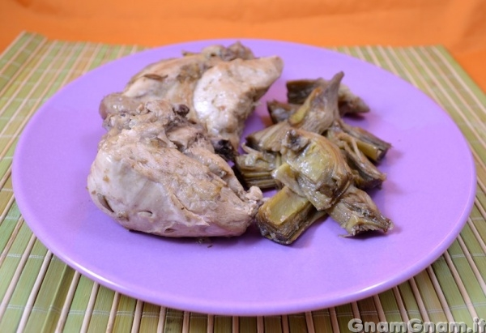

Ingredients
===========

* 500gr di pollo
* 4 carciofi
* 1 scalogno
* 1tsp di olio extravergine d'oliva
* 600ml di brodo vegetale caldo
* sale
* pepe
* succo di limone per i carciofi

Preparation
===========

Pulite i carciofi eliminando le estremità, le foglie esterne piu’ dure e la barbetta interna.

Tagliateli a spicchi.

Teneteli da parte in acqua acidulata con succo di limone.

In una padella rosolate lo scalogno nel cucchiaio d’olio.

Aggiungete il pollo e fatelo rosolare qualche minuto.

Aggiungete il brodo, un po’ di sale, pepe ed i carciofi.

Coprite e fate cuocere circa 25 minuti, rigirando di tanto in tanto. Scoprite e lasciate asciugare il brodo in eccesso. Aggiustate di sale e pepe e servite il vostro pollo ai carciofi!

Notes
=====
