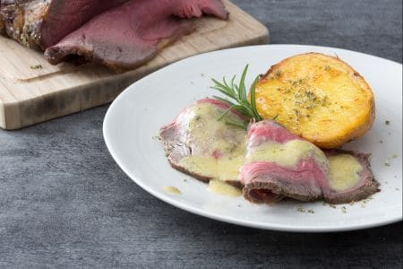

Tipico della tradizione anglosassone, il roast-beef all'inglese viene solitamente preparato per il pranzo della domenica, da gustare in compagnia di tutta la famiglia. Accompagnato dai contorni più vari, a base di patate o di verdure, è divenuto famoso in tutto il mondo, tanto da essere presente sulle tavole degli italiani anche nei giorni di festa, come Pasqua o Natale. Ma una ricetta così facile si può proporre durante tutto l'anno, anche solo per una cena tra amici o un compleanno...i passaggi da effettuare sono veramente semplici ed oggi lo chef Cesare Battisti ci ha mostrato tutti i trucchi per ottenere una carne succosa e tenera. 

Ingredients
===========

* 1kg Controfiletto di manzo
* 60gr Sale grosso
* 15gr Salvia
* 15gr Rosmarino
* 30gr Olio extravergine d'oliva
* 1/2tsp Senape gialla in polvere

Per le patate

* 600gr Patate
* 20gr Olio extravergine d'oliva
* 40gr Burro
* 1 spicchio Aglio
* 1 rametto Rosmarino

Per la citronette

* Succo di 1 limone
* 30gr Olio extravergine d'oliva
* 1tsp Senape

Preparation
===========

Per preparare il roast beef all'inglese come prima cosa ponete a bollire le patate di accompagnamento; dovranno essere ma non sfaldarsi a fine cottura. Poi ripulite la carne dal grasso in eccesso; non bisogna toglierlo tutto perchè questo aiuterà a mantenere l'umidità della carne. Fatto questo occorrerà legarla cosicché una volta cotta avrà una forma regolare. Come prima cosa sistemate la carne su un tagliere e munitevi dello spago; quindi fatelo scivolare prima sotto la carne e poi sopra, per il senso della lunghezza. Per fermare lo spago a questo punto fate un nodino su una delle due estremità, lasciando una parte di spago più lunga. 

Con questa fate un giro intorno alla carne e legatela nuovamente con un nodino per bloccarla. A questo punto basterà fare diversi giri intorno alla carne, in modo da creare la tipica gabbia e una volta arrivati alla fine dovrete tornare indietro in modo da fare altri due giri di filo. Per serrare il tutto occorrerà creare un'asola facendo un paio di giri intorno alla mano; una volta che avrete fatto passare l'arrosto all'interno, basterà tirare leggermente lo spago. 

Una volta legata la carne bisognerà preparare il sale aromatico. Per prima cosa lavate e tamponate con della carta assorbente le erbe aromatiche. Versate nel cutter il sale, il rosmarino e la salvia. 

Chiudete con il suo coperchio e frullate il tutto, aggiungete poi anche la senape in polvere e frullate nuovamente. A questo punto versate per comodità il rub in un'altra ciotola.

Prelevatene un pizzico e utilizzatelo per condire la carne, massaggiatela con le mani in modo da spargere ovunque il rub; tenete da parte il resto per un momento. A questo punto scaldate un filo d'olio in un tegame e rosolate la carne per bene da tutti i lati, prestando attenzione a non bucarla. Non abbiate fretta, e solo quando la carne sarà ben abrustolita trasferitela di nuovo sul tagliere. 

A questo punto unite un mezzo cucchiaio d'acqua nel sale alle erbe e mescolate il tutto. Poi utilizzatelo per ricoprire la parte superiore dell'arrosto, dispondendolo prima al centro con un cucchiaio e poi spargendolo bene con le mani e pressandolo delicatamente per farlo aderire al meglio. 

Una volta fatto questo trasferite il pezzo di carne su una griglia posizionata all'interno di una leccarda, non toccando direttamente sul fondo della placca cuocerà in maniera uniforme. Cuocete il tutto in forno preriscaldato in modalità ventilata a 220° nel ripiano centrale per 15 minuti. Trascorso questo tempo abbassate la temperatura a 180° e cuocete per altri 10/12 minuti. La temperatura al cuore della carne dovrà essere compresa tra i 48-52° a seconda se si preferisce più al sangue o rosato. Nel frattempo le patate saranno cotte e potrete scolarle. A questo punto tagliate le patate a metà nel senso della lunghezza.

Poi scaldate la padella con un filo d'olio, il burro e uno spicchio d'aglio pelato, privato dell'anima e tagliato a metà. Adagiate le patate all'interno del burro sciolto, posizionandole con la parte appena tagliata rivolta verso il basso. Lasciate rosolare bene le patate, aggiungendo un rametto di rosmarino, e nel frattempo, tenendole sempre sotto controllo, preparate la citronette. 

In una ciotola versate il succo di limone, la senape, l'olio extravergine d'oliva e sbattete il tutto con una frusta fino ad ottenere un'emulsione stabile.

Trascorso il tempo di cottura estraete la carne dal forno. A questo punto girate anche le patate che saranno ben dorate e aspettate un altro minuto prima di spegnere il fuoco. Nel frattempo coprite la carne con la carta argentata; in questo modo i succhi si ridistribuiranno nelle fibre e la temperatura al cuore aumenterà ancora di un paio di gradi. 

Adesso trasferite la carne su un tagliere, eliminate la carta stagnola, prelevate un pezzettino della crosticina di erbe presente sulla carne. Sbriciolatela all'interno della citronette, mescolate con una frusta per farlo sciogliere completamete. Staccate anche la parte restante della crosticina ed eliminate lo spago. 

Affettate la carne e riprendete le patate; siete prondi ad impiattare. Trasferite in ciascun piatto un paio di fettine di carne ed una patata. Versate un pò di citronette solo sulla carne e decorate con un ciuffetto di rosmarino. 

Notes
=====

Il roast-beef si può conservare per 1 giorno al massimo in frigorifero. Si sconsiglia la congelazione.

Se non avete un termometro da cucina si può utilizzare un ago per lardellare gli arrosti che è molto lungo; infilandolo nella carne e avendo cura di arrivare al centro si può sentire la temperatura. Estraendolo e appoggiandolo sotto il labbro inferiore dovrà essere più caldo rispetto alla vostra temperatura ma sopportabile, non bollente da scottarsi. 

Il roastbeef tagliato a fette spesse si può servire caldo, ma se si vuole preparare in anticipo è bene tagliarlo a fette sottili e servirlo freddo. 
