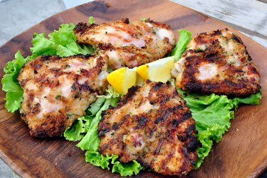

Le sovracosce di pollo in crosta sono un secondo piatto appetitoso e gustoso preparato al barbecue. Le carnose sovracosce di pollo in questa ricetta, prima di essere cotte, vengono passate in un'impanatura aromatica che dà sapore alla carne.

Ingredients
===========

* 4 Cosce di pollo
* 200gr Pane bianco in cassetta
* 3tbsp Prezzemolo tritato
* 2 spicchi Aglio tritato
* 1tbsp Scorza di limone
* 4tbsp Olio extravergine d'oliva
* 1tsp Pepe nero macinato
+ 1tsp Sale fino

Preparation
===========

Grattugiare il pane a cassetta. Condire la mollica ricavata con la scorza del limone grattugiato, il sale, il prezzemolo, il pepe, gli spicchi d'aglio tritati e l'olio.

Quindi amalgamate il tutto con le mani, creando una panatura dove gli ingredienti dovranno essere miscelati per bene. Quindi occupatevi delle sovracosce, spellatele se necessario e spennellatele con l'olio d'oliva

quindi passate le sovracosce nella panatura, facendo in modo che aderisca bene da entrambi i lati  aiutandovi anche con le dita esercitando una leggera pressione.

Preriscaldare il grill alla massima potenza. Abbassare a fiamma media e cuocere le sovracosce 7/8 minuti per lato fino al raggiungimento di una crosta scura e croccante (10-11). Servire con uno spicchio di limone (12).

Notes
=====
