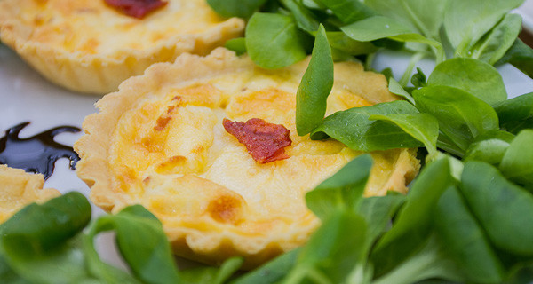

Torta salata di Stephanie (BakeOff Italia 2): mini quiche di pasta brisè con ripieno di speck e fontina
This would be the description of the recipe. Any info or history about the recipe goes here

Ingredients
===========

Per la Pasta Brisé

* 500gr farina 00
* 1 pizzico sale
* 250gr burro
* 4 tuorli
* 100ml acqua

Per la farcitura

* 4 uova
* 400gr speck
* 500ml panna
* 250gr formaggio valdostano
* Noce moscata qb
* Sale qb
* Pepe qb
* Insalata valeriana qb

Preparation
===========

### Per la pasta brisèe

Mescolare la farina e il sale con il burro finché l’impasto non diventa sabbioso. Aggiungere i tuorli e poi lentamente l’acqua fredda. Lasciare riposare in frigorifero, avvolto nella pellicola. Mettere l’impasto in stampini imburrati e infarinati e cuocere in forno per 10 minuti. Tagliare l’eccesso e rimettere in forno per 2-3 minuti.

### Per la farcitura

Tostare lo speck in padella fino a farlo diventare croccante.  Mescolare le uova, la panna e il formaggio. Aggiungere a piacere sale, pepe e noce moscata. Aggiungere lo speck negli stampini e versarvi sopra il composto di uova. Mettere in forno finché non si dora.

Servire le mini quiche con foglie di insalata intorno.

Notes
=====
