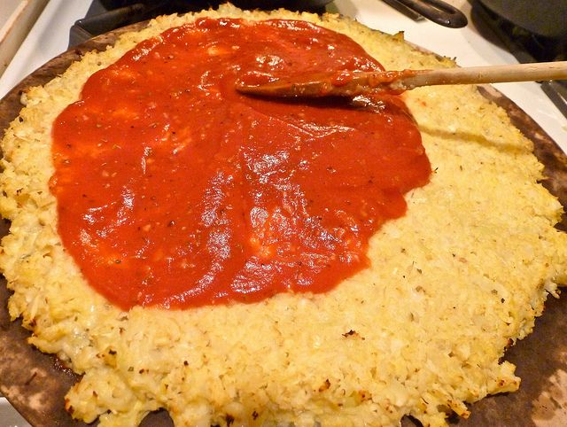

La pizza di cavolfiore che, contrariamente a quanto si potrebbe pensare, è davvero gustosa, non è altro che una preparazione "alternativa" a quella classica senza, però, alcuna traccia di farina al suo interno. Adattata alla dieta Dukan, si tratta di una pietanza imperdibile che permette a chi sia a dieta, ma anche no, di gustare un'ottima pizza a pranzo o a cena senza l'incubo della bilancia. In quanto alla farcitura sbizzarritevi pure con tutte le verdure del caso o con qualche formaggio magro.

Ingredients
===========

* 800gr di cavolfiore crudo pulito
* 100gr di formaggio spalmabile 0,1% di grassi
* 1 uovo
* origano qb
* sale e pepe
* pomodori qb
* funghi qb
* prosciutto cotto light qb

Preparation
===========

Cuocere il cavolfiore già pulito e tagliato a pezzi a vapore per circa 30 minuti. Trasferire su un canovaccio pulito e fare raffreddare. Avvolgere bene e stringere in modo da fare uscire tutta l'acqua e fino ad ottenere una sorta di poltiglia. Trasferirlo in una ciotola ed unire l'uovo, il formaggio spalmabile, regolare di sale e pepe ed unire dell'origano. Amalgamare bene il tutto. Trasferire il composto su una teglia rivestita di carta forno premendo bene e livellando e porre in forno preriscaldato a 180°C. Fare cuocere per 40 minuti. Prelevare la pizza e guarnirla a piacere quindi porre nuovamente in forno per una decina di minuti e servire.

Notes
=====
