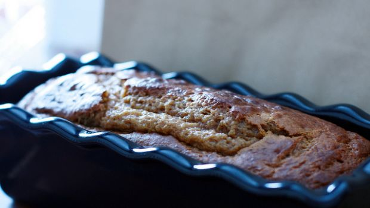

Il plumcake salato, ottima variante di quello dolce, che tutti conosciamo, è una preparazione pratica e versatile. Può costituire un antipasto invitante, tagliato e servito a fette, farcito con affettati di diverso tipo, un secondo rustico, magari accompagnato con una fresca insalata o delle verdure grigliate o lesse ed è infine eccezionale per i picnic e per i buffet.

Molte sono le possibili varianti del plumcake salato ma oggi vorrei darvi la ricetta base da potere arricchire a piacere in base ai vostri gusti. 

Ingredients
===========

* 3 uova 
* 150gr farina
* 1 bustina di lievito istantaneo per torte salate
* 100ml di olio di semi
* 125ml di latte tiepido
* 100gr di parmigiano grattugiato
* sale qb

Preparation
===========

Versare nel mixer le uova, unire la farina, il lievito istantaneo per torte salate e lavorare qualche minuto. Unire quindi l’olio di semi, il latte tiepido e il formaggio grattugiato. Se si utilizzano altri ingredienti unirli adesso. Mescolare bene il tutto fino ad ottenere un composto omogeneo e versare in uno stampo imburrato ed infarinato da plumcake. Trasferire in forno caldo e cuocere per circa 45 minuti a 180 °C. Fare raffreddare completamente ed estrarre dallo stampo.

Notes
=====
