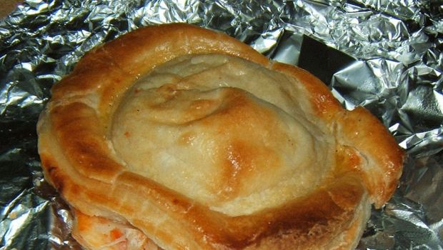

Si tratta di una preparazione semplicissima: due dischi di pasta sfoglia del diametro di circa 10 cm che racchiudono al loro interno un ripieno cremoso di besciamella, mozzarella e pomodoro, almeno nella versione acquistata. Preparandolo in casa potrete realizzare un’unica torta salata da tagliare poi a pezzi. Cotto in forno e gustato caldo, o meglio tiepido, rappresenta una tantazione irresistibile per il palato.

I rustici leccesi sono tipici del Salento, dove è possibile trovarli ad ogni ora del giorno e presso tutte le rosticcerie e bar. Rappresentano un goloso spuntino di metà mattina così come sono ideali da gustare in serata. Un consiglio: sarà bene conservare i rustici, prima della cottura, in frigo per almeno un’ora. Questo riposo garantirà l’ottima resa della pasta sfoglia dopo la permanenza in forno. Ecco la ricetta originale proveniente da quì.
This would be the description of the recipe. Any info or history about the recipe goes here

Ingredients
===========

* 500gr di pasta sfoglia
* 250ml di latte
* 1tbsp di farina
* 25gr burro
* 150gr fior di latte
* qualche pomodoro pelato
* sale e pepe qb.
* 1 tuorlo d’uovo

Preparation
===========

Preparare la besciamella facendo sciogliere in una pentola su fuoco basso il burro ed unendo la farina. Aggiungere quindi il latte e sempre sul fuoco continuare a mescolare fino ad ottenere un composto denso. Salare e pepare. Prendere la pasta sfoglia e lavorarla brevemente con poca farina. Stenderla e formare due dischi. Rivestire una teglia ricoperta di carta forno con metà pasta sfoglia e porre sul fondo la besciamella, poi qualche pomodoro ed infine il fior di latte. Coprire con il secondo disco di pasta sfoglia, spennellare con il tuorlo d’uovo e infornare a 180 gradi per circa 20 minuti. A fine cottura completare con qualche minuto sotto il grill. Servire caldo o tiepido.

Notes
=====
