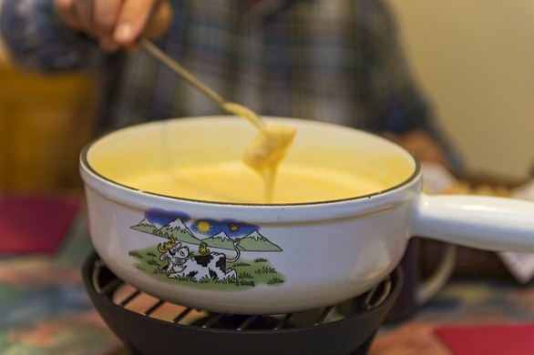

Ingredients
===========

* 200gr di emmental
* 150gr di parmigiano
* 50gr di gorgonzola dolce
* 1 spicchio di aglio
* 1 bicchiere di vino bianco secco
* 1 cucchiaino di farina
+ noce moscata
* sale e pepe

Preparation
===========

Strofinare le pareti della ciotola nella quale prepararete la fonduta con lo spicchio di aglio. Tagliare i formaggi molto sottilmente e versarli all’interno. Adesso unire il vino bianco all’interno del quale avrete sciolto la farina. Regolare di sale e pepe e porre sul fuoco continuando a mescolare fin quando i formaggi si saranno sciolti.

Notes
=====

