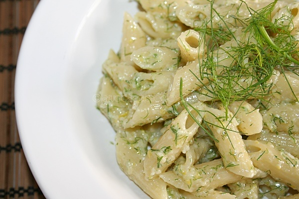

Il pesto limone e mandorle, proprio come la ricetta del pesto con limone e tonno protagonista del video qui sopra, è un ottimo condimento per poter presentare in tavola dei primi piatti leggeri e gustosi al tempo stesso, che parlino di sapori tipicamente estivi da poter assaporare in compagnia degli amici. E' una variante di pesto davvero semplice da preparare.

Se il classico pesto per la pasta vi ha un po' stancato e volete provare una versione un po' alternativa, sicuramente rimarrete deliziati dalla ricetta del pesto con limone e mandorle: due sapori decisamente diversi tra di loro, che si sposano insieme alla perfezione per un primo piatto che lascerà tutti piacevolmente sorpresi.

Ingredients
===========

* mandorle
* limoni
* 100gr di pecorino
* olio extravergine di oliva
* finocchietto

Preparation
===========

Tritate le mandorle nel mixer con la scorza di un limone, 50 grammi di pecorino, un po' di finocchietto. Aggiungete pochissimo olio.

Aggiungete nel mix un po' di acqua di cottura della pasta con un po' di acqua fredda e continuate a tritare. Aggiungete tanta acqua quanto è necessaria per ottenere una bella cremina.

Condite poi la pasta (meglio se corta, come le trofie) con questo pesto, facendo saltare il tutto in padella, magari con un po' di olio e aglio rosolato.

Notes
=====
