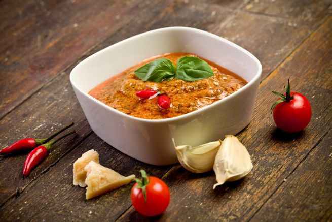

Il pesto rosso è buonissimo e fresco ed è una valida alternativa a quello classico al basilico, è perfetto per condire la pasta o il cous cous, ma anche da spalmare sui crostini di pane o per dare più gusto alla pizza. La ricetta del pesto rosso è semplicissima, vediamola insieme!

Ingredients
===========

* 100gr di pomodori secchi sott’olio
* 100gr di mandorle tostate
* 50gr di basilico
* 1 spicchio di aglio
* Sale
* Olio extravergine di oliva
* 4 cucchiai di parmigiano grattugiato

Preparation
===========

Prendete un mixer e mettete le mandorle, tritatele e poi mettetele da parte. Nello stesso mixer aggiungete i pomodorini secchi, il basilico e l’aglio, frullate tutto fino ad avere un composto cremoso e senza pezzi. Mescolate questa crema con le mandorle e il parmigiano e aggiungete il sale e circa 7 – 8 cucchiai di olio extravergine di oliva. Mescolate tutto con un cucchiaio e servite.

Se i pomodori secchi non sono piccanti potete aggiungere al vostro pesto rosso un peperoncino rosso.

Notes
=====
