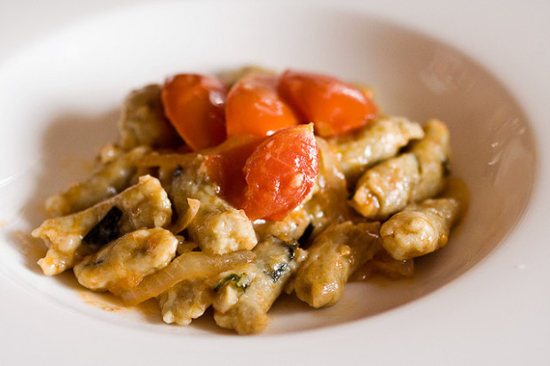

Il pesto è uno dei classici condimenti della bella stagione, sono veloci e molto buoni, versatili e saporiti e si possono utilizzare per condire la pasta, il cous cous, le insalate ma anche panini, sandwich, tramezzini ecc. Oggi vi presento una ricetta molto particolare per preparare il pesto di melanzane alla siciliana, buonissimo e perfetto da servire in ogni occasione!

Ingredients
===========

* 1 melanzana
* 1 cucchiaino di peperoncino
* 2 spicchi di aglio
* Basilico fresco
* Sale
* Olio extravergine di oliva

Preparation
===========

Prendete una melanzana, lavatela bene e poi tagliatela longitudinalmente, praticate all’interno delle incisioni, coprite con il sale, capovolgetele e fate riposare per mezz’oretta. Raschiate il sale e poi mettetele su una piastra di quelle che si chiudono, se non l’avete potete usarne una normale e mettere sopra un coperchio. Le melanzane devono essere sistemate con la parte tagliata verso il basso e devono cuocere per circa 30 minuti a fuoco medio.

Con un cucchiaio raccogliete la polpa di melanzana e mettetela nel bicchiere del minipimer, aggiungete l’aglio, il basilico, il peperoncino, il sale e un po’ di olio extravergine di oliva (almeno 4 cucchiai). Frullate bene tutto fino ad avere un composto cremoso.

Notes
=====

Il pesto lo potete usare per condire la pasta, se vi sembra troppo cremoso vi basterà stemperarlo con un po’ di acqua di cottura della pasta. Se volete potete accompagnare questo pesto con dei pomodorini confit e della ricotta salata grattugiata, avrete quasi una pasta alla norma destrutturata!
