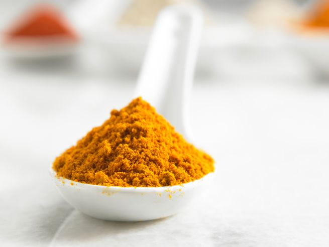

La salsa al curry con yogurt greco rappresenta uno dei condimenti più gustosi con cui poter accompagnare diversi alimenti. Si sposa, però, alla perfezione con il pollo ed il riso basmati, dando vita ad una pietanza semplice, appagante e completa, adatta ad un pranzetto da portare in tavola in qualsiasi occasione.

Realizzare la salsa al curry è piuttosto semplice: questa è la variante che si ottiene con lo yogurt greco, per un risultato cremoso e dal sapore inconfondibile. Una volta pronta scegliete l'uso che vogliate farne: inutile sottolineare come quello più indicato sia in accompagnamento al petto di pollo tagliato a dadini e fatto cuocere in padella, con o senza mele a tocchetti, per un secondo pronto a conquistare.

Ingredients
===========

* 250gr di yogurt greco
* 4 cucchiaini di curry
* 1 noce di burro
* 1 cucchiaino di farina 00
* 1 pizzico di sale

Preparation
===========

Versare in un pentolino il burro ed una volta sciolto unire sia la farina setacciata che il curry. Mescolare bene e fin da subito fino ad ottenere un composto molto denso ed omogeneo. Adesso spegnere la fiamma ed unire lo yogurt greco. Mescolare bene e regolare di sale e pepe. Utilizzare la salsa ottenuta a piacere con il pollo o per condire il riso basmati.

Notes
=====
