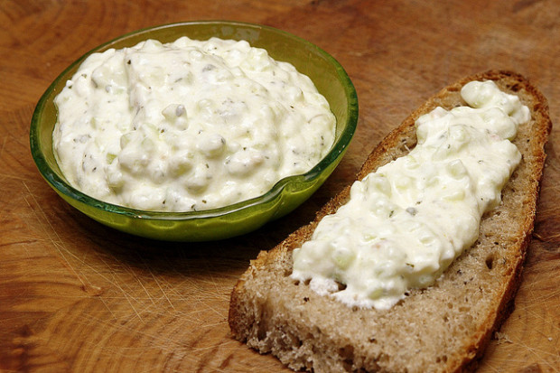

La ricetta della salsa greca tzatziki è perfetta se vogliamo creare un antipasto originale che lasci senza parole i nostri commensali: molto semplice da realizzare, anche all'ultimo minuto, è una salsa che può essere mangiata da sola, ma può anche essere usata per condire un'insalata di olive e di feta, per rimanere in tema di cucina greca, oltre che accompagnare crostini di pane abbrustoliti, verdure e secondi piatti di carne.

La preparazione della salsa greca tzatziki è davvero molto semplice, così come lo sono i suoi ingredienti, tipici della cucina greca: abbiamo, infatti, lo yogurt greco, i cetrioli, l'aglio, l'olio di oliva. Possiamo impreziosire questo antipasto semplice e veloce da creare con delle olive nere, tipiche di questa bellissima terra del Mediterraneo, oltre che con spezie come aneto e menta.

Ingredients
===========

* 300gr di yogurt greco al naturale
* 1 cetriolo
* 2 spicchi di aglio
* sale
* olio extra vergine di oliva

Preparation
===========

Lavate e tagliate il cetriolo, affettandolo. Mettetelo in un colino, aggiungete del sale grosso e fatelo riposare per 30 minuti, per eliminare l'acqua interna.

Strizzate il cetriolo e mettetelo nel mixer con l'aglio e due cucchiai di olio extra vergine di oliva, per ottenere un composto omogeneo.

Aggiungete lo yogurt greco e mescolate per far amalgamare tutti gli ingredienti.

Aggiustate di sale e di pepe.

Notes
=====
