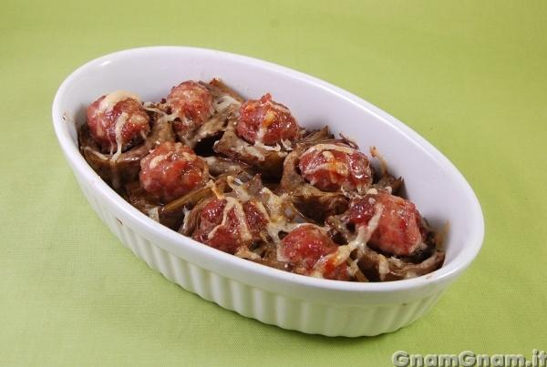

Ingredients
===========

* 6 carciofi
* 300g di salsicce
* 1 spicchio d'aglio
* 50g di parmigiano
* 400ml di brodo vegetale
* sale
* pepe
* olio extravergine d'oliva
* succo di limone

Preparation
===========

Pulite i carciofi: tagliare la parte superiore dei carciofi (circa un cm) e il fusto, ed eliminare le foglie più esterne.

Tagliateli a metà, eliminate la barbetta interna e metteteli in acqua acidulata con succo di limone per non farli annerire.

In una padella rosolate uno spicchio d’aglio, eliminatelo e fate rosolare i carciofi con la parte interna rivolta verso l’alto e senza girarli.

Dopo qualche minuto coprite con il brodo.

Coprite i carciofi e cuocete a fiamma bassa per circa 20-30 minuti.

Aggiungete le salsicce senza budello e arrotondate a forma di polpetta.

Lasciate cuocere senza coperchio finchè il brodo non sarà evaporato del tutto.

A questo punto trasferite in una terrina leggermente unta e spolverate con il parmigiano.

Fate gratinare i carciofi ripieni di salsiccia in forno statico preriscaldato a 200° per circa 10  minuti.

Notes
=====
