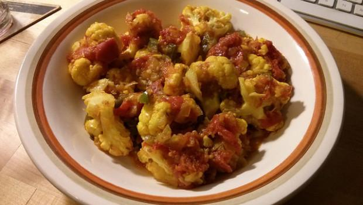

Il **cavolfiore alla romagnola** rappresenta una **ricetta semplice** e di grande gusto per un contorno davvero saporito. Io amo il cavolfiore anche solo lessato e condito con un filo di olio, ma questa versione ha decisamente una marcia in più data innanzitutto dall'aggiunta dei pomodori (in questo caso pelati, ma che in alcune versioni vengono egregiamente sostituiti dal concentrato), ed inoltre dal parmigiano grattugiato e dal prezzemolo fresco spolverati in superficie prima di servire la pietanza.

Insomma, un contorno assolutamente consigliato agli amanti delle verdure oltre che una pietanza vegetariana alla quale ricorrere in ogni occasione. Il cavofiore alla romagnola si presta ad accompagnare secondi piatti a base di carne, sia semplici che elaborati. Il giorno dopo è anche più buono. Altre ricette che potrebbero interessarvi sono quella del[ cavolfiore e patate al forno con besciamella](http://www.gustoblog.it/post/143144/il-cavolfiore-e-patate-al-forno-con-besciamella-per-un-secondo-appagante) e del[ cavolfiore gratinato con la ricetta per il Bimby.](http://www.gustoblog.it/post/128655/ecco-il-cavolfiore-gratinato-con-la-ricetta-per-il-bimby)

Ingredients
===========

* 1 cavolfiore
* 40gr di parmigiano grattugiato
* 200gr di pomodori pelati
* 1 spicchio d’aglio
* prezzemolo fresco
+ olio extravergine di oliva qb
+ sale e pepe

Preparation
===========

Pulire bene il cavolfiore quindi dividerlo in cimette e farlo lessare giusto un paio di minuti in acqua bollente salata. Scolarlo e tenerlo da parte. Adesso versare in un tegame ampio l'olio, aggiungere lo spicchio d'aglio e fare soffriggere. Una volta imbiondito unire i pomodori pelati e fare cuocere per circa 5 minuti. Aggiungere adesso le cimette di cavolfiore, mescolare bene, regolare di sale e pepe e portare a cottura, unendo, man mano, l'acqua necessaria. Una volta cotto servire il cavolfiore irrorato con un filo di olio e spolverato con il parmigiano ed il prezzemolo tritato.

Notes
=====
