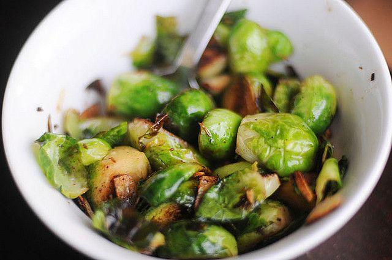

Contorno semplice, sfizioso e sicuramente diverso dal solito, i **cavolini di Bruxelles con pancetta** rappresentano l'accompagnamento ideale per secondi piatti a base di carne. Allo stesso tempo, però, possono andare a costituire un secondo a tutti gli effetti, tanto sono appaganti. Non richiedono che pochi ingredienti, ma quelli utilizzati sono in grado di esaltare alla grande il sapore di questi piccoli e sfiziosi ortaggi. Ecco come preparare il contorno saporito.

Ingredients
===========

* 800gr/1kg di cavolini di Bruxelles
* 200gr di pancetta
* 1 spicchio di aglio
* olio di oliva qb
+ sale e pepe

Preparation
===========

Fare rosolare in una padella lo spicchio di aglio in poco olio. Una volta dorato unire la pancetta e fare rosolare anche questa. Aggiungere adesso i cavolini e farli insaporire, quindi abbassare la fiamma, porre il coperchio e continuare la cottura per almeno 20 minuti, avendo l'accortezza di girare di tanto in tanto ed unire poca acqua nel caso risulti necessario. Regolare di sale e pepe e servire.

Notes
=====
