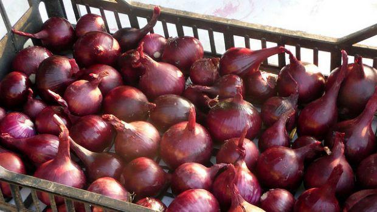

Quando si parla di cipolle rosse si tende ad associarle a quelle, famose, di Tropea. Ed anche in questo caso, quelle utilizzate in questa preparazione sono proprio quelle calabresi. Le cipolle rosse di Tropea del resto hanno una serie di proprietà incredibili. Oltre ad un sapore molto dolce dovuto in parte alla presenza di una quantità cospicua di zuccheri, che le rende particolarmente gradite al palato, sono facilmente digeribili, poco caloriche ed utilizzate con successo come rimedi medici naturali.

Tra le molte preparazioni a base di cipolle,[ ottima tra l’altro la marmellata](http://www.gustoblog.it/post/29729/la-marmellata-di-cipolle-rosse-di-tropea-la-ricetta-facile), anche le **cipolle rosse in agrodolce** risultano sfiziose. Facili da preparare anche anche in casa con pochi ingredienti si prestano ad essere servite come antipasto insieme a formaggi vari o[ come contorno goloso insieme ad altre verdure, come gli spinaci.](http://www.gustoblog.it/post/10283/ricette-contorni-spinaci-al-vapore-con-cipolla-in-agrodolce) Ecco come preparare le cipolle rosse in agrodolce.

Ingredients
===========

* 6-7 cipolle di Tropea
* olio extra vergine di oliva
* 3 cucchiai di zucchero
* 250ml di aceto di vino rosso
* sale

Preparation
===========

Sbucciare le cipolle e tagliarle a fette sottili. Versarle in una padella nella quale avrete messo a scaldare poco olio. Farle cuocere a fiamma alta per qualche minuto, non dovranno cuocersi completamente ma conservare la loro croccantezza. Unire quindi lo zucchero, un pizzico di sale e l’aceto, ed una volta completamente evaporato quest’ultimo, spegnere la fiamma. Le cipolle sono pronte.

Notes
=====
