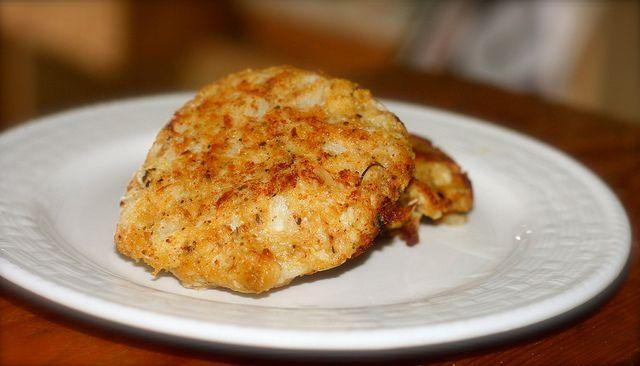

Le **cotolette di cavolfiore al forno** rappresentano la ricetta ideale per chi non nutra troppa simpatia per tale ortaggio. Così preparato, infatti, non solo cambia completamente aspetto, ma anche il sapore ne trae grande giovamento. Punto a favore delle cotolette sta nella loro cottura in forno che ne assicura un risultato più **leggero**. Ottime anche per i bambini, si prestano a costituire uno sfizioso secondo vegetariano. Nel caso in cui vogliate regalare un ulteriore tocco di gusto unite al composto di uova anche un paio di cucchiai di parmigiano grattugiato.

Ingredients
===========

* 1 cavolfiore medio
* 2 uova
* pangrattato e farina 00 qb
* prezzemolo fresco tritato
* sale e pepe

Preparation
===========

Lessare il cavolfiore, ridotto in cimette, in acqua bollente salata fino a quando risulta tenero. Scolarlo e farlo intiepidire. Adesso versare in una ciotola le uova con il sale, il pepe ed il prezzemolo. Sbattere bene. Disporre in due piatti il pangrattato e la farina. Passare i pezzi di cavolfiore prima nella farina, poi nelle uova ed infine nel pangrattato facendolo aderire bene. Porre in una teglia rivestita di carta forno e irrorare con un filo di olio. Fare cuocere a 180 °C per circa 25 minuti.

Notes
=====
