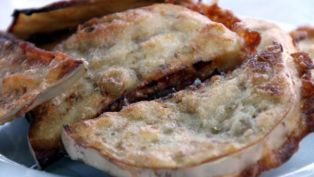

Inutile dire come queste **cotolette di melanzane ripiene** rappresentino una preparazione allettante, adatta al pranzo o alla cena di tutta la famiglia. In casa mia portarle in tavola equivale ad una festa e state sicuri che al momento di sparecchiare non ne sarà rimasta neanche una. Nello specifico si tratta di cotolette composte da due fette di melanzane unite a mo' di sandwich e farcite con una fetta di prosciutto cotto e con una di scamorza (quest'ultima può essere sostituita con della mozzarella, ma asciutta, o del galbanino).

Una volta impanate e fritte diventano irresistibili, ma fatele riposare quache minuto prima di gustarle per dare il tempo al formaggio sciolto di raffreddarsi leggermente ed evitare spiacevoli ustioni alla lingua. Su questo genere vi consiglio di provare anche[ le cotolette di peperoni al forno](http://www.gustoblog.it/post/137444/cotolette-di-peperoni-al-forno-la-ricetta-di-un-secondo-piatto-originale) e[ quelle di funghi pleurotus.](http://www.gustoblog.it/post/138052/come-preparare-le-cotolette-di-funghi-pleurotus)

Ingredients
===========

* 2 melanzane viola lunghe
* 200gr di scamorza o formaggio filante
* 100gr di prosciutto cotto affettato
* sale e pepe
* farina qb
* pane grattugiato qb
* 2 uova
* olio di semi per la frittura

Preparation
===========

Lavare le melanzane, eliminare le estremità e tagliarle a fette per il lungo. Adesso tagliare la scamorza a fette e disporre le melanzane sul piano da lavoro. Farcire metà delle fette di melanzane con una di scamorza ed una di prosciutto cotto. Pronte le cotolette passarle prima nella farina, poi nelle uova sbattute leggermente con un pizzico di sale ed infine nel pangrattato, facendolo aderire bene anche sui bordi. Adesso versare in una padella ampia abbondante olio di semi e scaldarlo, quindi adagiare dentro le cotolette di melanzane e friggerle da entrambi i lati fin quando risultano dorate. Scolarle su carta assorbente e servirle.

Notes
=====
