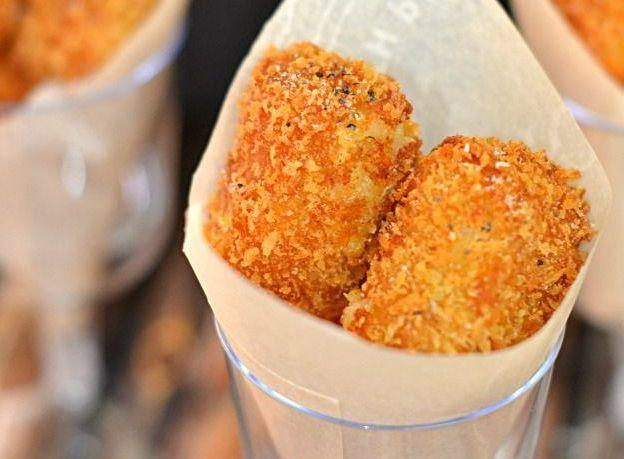

Le **crocchette di patate** sono un antipasto sfizioso, goloso e amatissimo da tutti, invece di comprare quelle surgelate potete farle in casa, sono **economiche** ed anche molto semplici. Le crocchette[ potete personalizzarle](http://www.gustoblog.it/post/172217/crocchette-di-mortadella-e-patate-la-ricetta-sfiziosa-di-alessandra-spisni) aggiungendo **prezzemolo**, paprica e anche pezzettini di **formaggio**.

Ingredients
===========

* 1kg di patate farinose
* 4 uova
* 80gr di parmigiano
* Sale
* Noce moscata
* Pepe
* Pangrattato
* Olio di semi per friggere

Preparation
===========

Lessate le **patate**, sbucciatele e poi schiacciatele con lo schiacciapatate, unite due **tuorli**, il **parmigiano**, sale, pepe e noce moscata e impastate bene. Prelevate piccole porzioni di impasto e fate dei **rotolini**.

In una ciotola sbattete due **uova** con un pizzico di sale ed in un’altra mettete il pangrattato con il sale. Passate i rotolini di patata nell’uovo e poi nel **pangrattato** e procedete così per tutto l’impasto. Mettete le crocchette in una tegli unta di olio e cuocetele in forno ben caldo a 190°C fino a quando saranno dorate, circa 30 minuti.

Notes
=====
