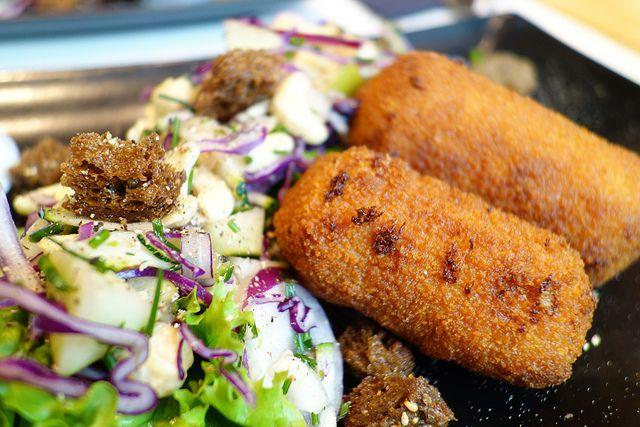

Le **crocchette di riso e patate al forno** non rappresentano che una delle tante varianti di tale preparazione, che non smette di conquistare a tavola. Le crocchette costituiscono anche un ottimo escamotage per fare fuori gli eventuali **avanzi** di riso cotto a pranzo e risultano talmente sfiziose da creare dipendenza. La **ricetta** che vi propongo è una sorta di base da arricchire a piacere con salumi e formaggi a cubetti.

Ingredients
===========

* 200gr di riso
* 3 patate grosse
* 50gr di parmigiano grattugiato
* olio extravergine d'oliva qb
* 2 uova
* pangrattato qb
* sale e pepe
* prezzemolo fresco
* olio di oliva qb

Preparation
===========

Fare cuocere il riso al dente in acqua bollente quindi scolarlo e conservarlo in una insalatiera insieme a poco olio. Lessare le patate, pelarle e passarle allo schiacciapatate, quindi riunirle nella ciotola con il riso ed unire anche le uova, il formaggio, il sale, il pepe ed il prezzemolo. Mescolare bene ed ottenuto un composto omogeneo creare delle crocchette da passare nel pangrattato facendolo aderire bene. Trasferirle in forno in una teglia unta di olio. Irrorarle con poco olio su tutta la superficie e fare cuocere a 180 °C per circa 20-25 minuti.

Notes
=====
