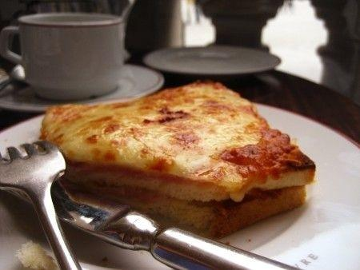

 			

Il croque mounsier e il croque madame, panini caldi a base di prosciutto e formaggio, sono l’alternativa[ francese](http://www.buttalapasta.it/s/cucina-francese/) al nostro toast, perfetti per uno spuntino, od un pranzo veloce. Preparateli per ritrovare il gusto di una vacanza trascorsa a Parigi, o se volete prepararvi ad andarci.

Se volete renderli un po’ più dietetici serviteli accompagnati con una bella insalata, condita con una[ vinaigrette a base di senape](http://www.buttalapasta.it/articolo/condire-linsalata-idee-per-una-insalata-da-gourmet/3135/).

Ingredients
===========

* 4 fette di pan carrè
* 2 fette di **prosciutto cotto**
* 2 fette di **formaggio** fondente, come la gruyère o il formaggio olandese, o se vi sentite nazionalisti di fontina (ma mai e poi mai delle sottilette)
* 2 noci di burro
* 2 cucchiai di gruyère grattugiato
* 1 uovo

Preparation
===========

Riscaldate il forno a 180 gradi.

Disponete su una placca 2 fette di pan carrè, metteteci sopra le due fette di **prosciutto** e quelle di **formaggio**, e terminate con le fette di pane.

Imburrate leggermente le due fette di sopra. Distribuite sopra i due croque il formaggio grattugiato. Infornate per qualche minuto, e terminare la cottura con il grill.

A parte fate cuocere l’**uovo all’occhio di bue** e deponetelo sopra uno dei due, ottenendo il **croque madame**. Servite subito.

Per un gusto più croccante sostituite il **formaggio** grattugiato con dei semi di sesamo.

Notes
=====
