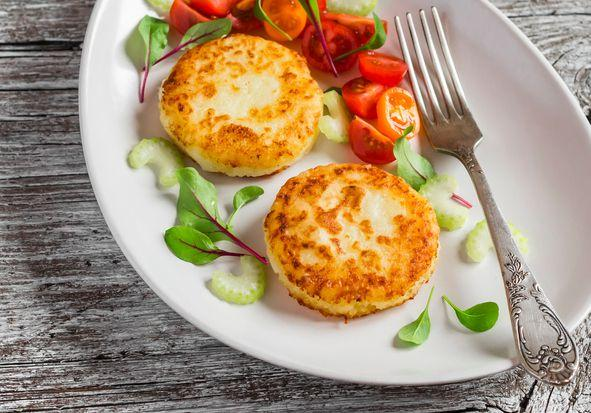

Appetitose come poche, le **focaccine di patate fritte** rappresentano una preparazione versatile e sfiziosa. Possono essere proposte per l'aperitivo o l'antipasto. Possono essere farcite con dei formaggi cremosi a scelta o dei salumi affettati o accompagnare i pasti in sostituzione del pane. Per rendere il composto più saporito ho unito del prezzemolo, ma nulla vieta di utilizzare dell'origano, altrettanto adatto.

Una volta pronte le foccacine vanno subito scolate su carta assorbente per fare assorbire l'unto in eccesso, quindi gustate quando sono ancora ben calde. Provate anche[ le focaccine morbide.](http://www.gustoblog.it/post/94297/le-focaccine-morbide-da-fare-con-la-ricetta-veloce)

Ingredients
===========

* 1 patata grossa
* 80-100gr di farina 00
* 1 cucchiaio di olio di oliva
* 1 pizzico di sale
* 2 cucchiaini di lievito istantaneo per torte salate
* latte qb
* olio per la frittura
* prezzemolo fresco

Preparation
===========

Lessare le patate, sbucciarle e passarle con lo schiacciapatate. Unire il resto degli ingredienti aggiungendo tanto latte quanto basta per ottenere un composto morbido e lavorando bene con le mani fino ad ottenere un impasto sodo ed elastico. Creare una palla e farla riposare per 10 minuti. Trascorso questo tempo creare delle focaccine da friggere in padella con olio di semi fino a completa doratura. Scolare su carta assorbente e servire ben calde.

Notes
=====
